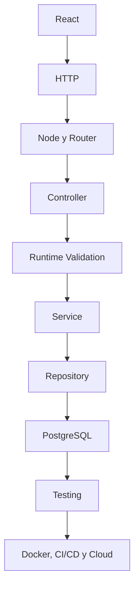

# Lección 22 — Exhaustividad práctica, `satisfies` y contratos seguros de configuración

**Ruta:** Full Stack Developer con TypeScript  
**Etapa actual:** TypeScript profundo  
**Duración estimada:** 15–20 minutos de estudio guiado  
**Práctica adicional sugerida:** 20–30 minutos  

---

## Introducción

En la lección anterior aprendiste a modelar estados y resultados con **discriminated unions**, a reducir cada variante con `switch` y a usar `never` para detectar casos no manejados.

Ahora vamos a llevar esa exhaustividad a otro problema cotidiano: las **tablas de configuración**.

Una aplicación profesional contiene muchos mapas como estos:

- estado de auditoría → etiqueta y color;
- resultado del servicio → código HTTP;
- entorno → configuración de logging;
- evento → función manejadora;
- permiso → acciones permitidas;
- tipo de dispositivo → estrategia de procesamiento.

El peligro aparece cuando agregas una nueva variante al dominio, pero olvidas actualizar uno de esos mapas. TypeScript puede ayudarnos a convertir ese olvido en un error de compilación.

La herramienta central será el operador `satisfies`. Su propósito es comprobar que un valor cumple un contrato **sin reemplazar innecesariamente el tipo específico que TypeScript infirió para ese valor**.

> Idea principal: `satisfies` comprueba un contrato en tiempo de compilación, pero no valida, transforma ni protege datos en runtime.

---

## Objetivo

Al terminar esta lección podrás:

1. explicar qué problema resuelve `satisfies`;
2. distinguir una anotación, una assertion y una comprobación con `satisfies`;
3. construir mapas exhaustivos a partir de literal unions;
4. detectar configuraciones incompletas cuando cambia el dominio;
5. combinar `as const`, `Record`, mapped types y `satisfies` correctamente;
6. aplicar el patrón en React, Node.js, una API REST y Bitácora de Red;
7. reconocer que estos contratos desaparecen en runtime;
8. validar datos externos con Zod antes de tratarlos como configuración confiable.

---

## 1. El problema: configuración que se desincroniza del dominio

Supón que Bitácora de Red utiliza estos estados:

```ts
type AuditStatus =
  | "draft"
  | "in_progress"
  | "completed";
```

La interfaz necesita una etiqueta para cada uno:

```ts
const statusLabels = {
  draft: "Borrador",
  in_progress: "En progreso",
  completed: "Completada",
};
```

Por ahora funciona. Más adelante agregas un estado:

```ts
type AuditStatus =
  | "draft"
  | "in_progress"
  | "completed"
  | "cancelled";
```

El objeto `statusLabels` sigue compilando porque nunca le dijimos a TypeScript que debía cubrir **todos** los valores de `AuditStatus`.

El error aparecerá en producción o durante una prueba visual:

```ts
const label = statusLabels[audit.status];
```

El dominio y la configuración dejaron de evolucionar juntos.

Necesitamos expresar el contrato:

> Por cada `AuditStatus` debe existir exactamente una configuración válida.

---

## 2. Primera solución: `Record`

`Record<Keys, Value>` construye un tipo de objeto cuyas claves son `Keys` y cuyos valores son `Value`.

```ts
type StatusLabelMap = Record<AuditStatus, string>;
```

Es equivalente conceptualmente a:

```ts
type StatusLabelMap = {
  draft: string;
  in_progress: string;
  completed: string;
  cancelled: string;
};
```

Podemos anotar el objeto:

```ts
const statusLabels: Record<AuditStatus, string> = {
  draft: "Borrador",
  in_progress: "En progreso",
  completed: "Completada",
  cancelled: "Cancelada",
};
```

Si falta `cancelled`, TypeScript marca un error. Esta solución es correcta y muchas veces suficiente.

Sin embargo, una anotación explícita puede hacer que la variable sea vista solamente a través del tipo general que escribimos. A veces queremos verificar ese contrato y conservar más detalles del valor original.

Ahí entra `satisfies`.

---

## 3. Qué hace `satisfies`

La sintaxis es:

```ts
const valor = expresion satisfies TipoEsperado;
```

Ejemplo:

```ts
const statusLabels = {
  draft: "Borrador",
  in_progress: "En progreso",
  completed: "Completada",
  cancelled: "Cancelada",
} satisfies Record<AuditStatus, string>;
```

TypeScript realiza dos trabajos:

1. comprueba que el objeto pueda asignarse a `Record<AuditStatus, string>`;
2. conserva el tipo inferido del objeto en lugar de sustituirlo completamente por el contrato.

Por eso el editor sigue conociendo las propiedades concretas de `statusLabels`.

```ts
statusLabels.completed.toUpperCase();
```

`satisfies` se puede leer así:

> “Comprueba que este valor satisface este contrato, pero conserva toda la información útil que puedas inferir del valor.”

---

## 4. Anotación vs `satisfies`

### 4.1 Anotación de tipo

```ts
const httpCodes: Record<AuditStatus, number> = {
  draft: 200,
  in_progress: 202,
  completed: 200,
  cancelled: 409,
};
```

La variable queda tipada como:

```ts
Record<AuditStatus, number>
```

Esto expresa claramente el contrato y es una buena opción si no necesitas preservar tipos literales más específicos.

### 4.2 Comprobación con `satisfies`

```ts
const httpCodes = {
  draft: 200,
  in_progress: 202,
  completed: 200,
  cancelled: 409,
} as const satisfies Record<AuditStatus, number>;
```

Aquí se comprueba el mismo contrato, pero además `as const` conserva los números como literales y vuelve las propiedades `readonly`:

```ts
const completedCode = httpCodes.completed;
// tipo: 200
```

La pregunta práctica es:

- usa una **anotación** cuando el tipo general representa exactamente cómo deseas utilizar la variable;
- usa **`satisfies`** cuando quieres comprobar un contrato y conservar la inferencia específica del valor;
- agrega **`as const`** cuando también necesitas literales y lectura inmutable.

---

## 5. Assertion `as` vs `satisfies`

Estas expresiones no significan lo mismo:

```ts
const labels = value as Record<AuditStatus, string>;
```

```ts
const labels = value satisfies Record<AuditStatus, string>;
```

Una assertion con `as` le pide al compilador que trate un valor como cierto tipo. Puede silenciar problemas sin demostrar que el objeto esté completo.

```ts
const unsafeLabels = {
  draft: "Borrador",
} as Record<AuditStatus, string>;
```

La assertion promete que existen todas las propiedades aunque no sea verdad.

En cambio, esto falla correctamente:

```ts
const safeLabels = {
  draft: "Borrador",
} satisfies Record<AuditStatus, string>;
// Error: faltan in_progress, completed y cancelled.
```

Regla profesional:

> No uses `as` para esconder una configuración incompleta. Usa un contrato comprobable y corrige el valor.

---

## 6. Exhaustividad con `Record` + `satisfies`

Podemos enriquecer la configuración de la interfaz:

```ts
type AuditStatus =
  | "draft"
  | "in_progress"
  | "completed"
  | "cancelled";

type StatusPresentation = {
  label: string;
  colorToken: "neutral" | "info" | "success" | "danger";
  canEdit: boolean;
};

const statusPresentation = {
  draft: {
    label: "Borrador",
    colorToken: "neutral",
    canEdit: true,
  },
  in_progress: {
    label: "En progreso",
    colorToken: "info",
    canEdit: true,
  },
  completed: {
    label: "Completada",
    colorToken: "success",
    canEdit: false,
  },
  cancelled: {
    label: "Cancelada",
    colorToken: "danger",
    canEdit: false,
  },
} as const satisfies Record<AuditStatus, StatusPresentation>;
```

Este contrato detecta:

- un estado faltante;
- una clave mal escrita;
- un `colorToken` inválido;
- una propiedad requerida ausente;
- un valor con tipo incorrecto.

Además, si agregas `"archived"` a `AuditStatus`, TypeScript te obliga a decidir cómo se presenta ese nuevo estado.

Eso es **exhaustividad práctica**: hacer que los cambios del dominio revelen los lugares que también deben cambiar.

---

## 7. `as const` y `satisfies` trabajan juntos, pero hacen cosas diferentes

Observa esta combinación:

```ts
const auditActions = {
  draft: ["edit", "delete", "start"],
  in_progress: ["edit", "complete", "cancel"],
  completed: ["reopen"],
  cancelled: ["reopen"],
} as const satisfies Record<AuditStatus, readonly string[]>;
```

`as const`:

- conserva literales como `"edit"`;
- convierte los arrays en tuplas `readonly`;
- vuelve las propiedades `readonly`.

`satisfies`:

- comprueba que existan todas las claves;
- comprueba que cada valor sea compatible con `readonly string[]`;
- no cambia el valor en runtime.

Si no necesitas literal types o inmutabilidad, no agregues `as const` por costumbre.

---

## 8. `satisfies` no produce un nuevo valor

Este código:

```ts
const config = {
  port: 3000,
} satisfies {
  port: number;
};
```

se convierte a JavaScript sin conservar el contrato TypeScript:

```js
const config = {
  port: 3000,
};
```

Por tanto, `satisfies`:

- no valida JSON;
- no valida `process.env`;
- no convierte strings a números;
- no agrega propiedades ausentes;
- no ejecuta comprobaciones en producción;
- no protege una respuesta HTTP;
- no comprueba filas devueltas por PostgreSQL.

Solo ayuda mientras TypeScript analiza el código fuente.

---

## 9. Contratos seguros para configuración interna

Considera una configuración definida dentro del repositorio:

```ts
type Environment = "development" | "test" | "production";

type LogLevel = "debug" | "info" | "warn" | "error";

type EnvironmentConfig = {
  logLevel: LogLevel;
  prettyLogs: boolean;
  enableRequestDetails: boolean;
};

const configByEnvironment = {
  development: {
    logLevel: "debug",
    prettyLogs: true,
    enableRequestDetails: true,
  },
  test: {
    logLevel: "error",
    prettyLogs: false,
    enableRequestDetails: false,
  },
  production: {
    logLevel: "info",
    prettyLogs: false,
    enableRequestDetails: false,
  },
} satisfies Record<Environment, EnvironmentConfig>;
```

Esta configuración es segura en compile time porque está escrita directamente en TypeScript.

Pero el valor que selecciona el entorno suele venir de una variable externa:

```ts
process.env.NODE_ENV
```

Ese dato no se vuelve confiable por usar `satisfies` en `configByEnvironment`. Debe validarse antes de indexar el mapa.

---

## 10. TypeScript type checking vs runtime validation

La frontera es fundamental:

```text
Código TypeScript escrito por el equipo
            ↓
type checking / satisfies / Record
            ↓
JavaScript generado
            ↓
datos reales de HTTP, formularios, APIs, archivos,
variables de entorno y PostgreSQL
            ↓
validación runtime
```

Podemos validar variables de entorno con Zod:

```ts
import { z } from "zod";

const EnvironmentSchema = z.enum([
  "development",
  "test",
  "production",
]);

const EnvSchema = z.object({
  NODE_ENV: EnvironmentSchema.default("development"),
  PORT: z.coerce.number().int().min(1).max(65_535).default(3000),
});

const parsedEnv = EnvSchema.parse(process.env);
```

Ahora `parsedEnv` contiene datos comprobados en runtime:

```ts
const selectedConfig = configByEnvironment[parsedEnv.NODE_ENV];

const appConfig = {
  port: parsedEnv.PORT,
  ...selectedConfig,
} satisfies EnvironmentConfig & { port: number };
```

Cada herramienta resuelve un problema distinto:

| Herramienta | Momento | Responsabilidad |
| --- | --- | --- |
| `satisfies` | Compile time | Comprueba que un valor TypeScript cumpla un contrato |
| `Record` | Compile time | Exige claves y tipos de valores |
| `as const` | Compile time | Conserva literales y agrega `readonly` superficial/profundo sobre el literal |
| Zod | Runtime | Comprueba y transforma datos reales |
| PostgreSQL constraints | Runtime/persistencia | Protege integridad en la base de datos |

---

## 11. Configuración exhaustiva en React

React suele renderizar estados del servidor. En lugar de dispersar condicionales por varios componentes, podemos centralizar la presentación:

```ts
type RequestState = "idle" | "loading" | "success" | "error";

type StateViewConfig = {
  ariaLive: "off" | "polite" | "assertive";
  showSpinner: boolean;
  message: string;
};

const requestStateView = {
  idle: {
    ariaLive: "off",
    showSpinner: false,
    message: "Listo para cargar auditorías",
  },
  loading: {
    ariaLive: "polite",
    showSpinner: true,
    message: "Cargando auditorías",
  },
  success: {
    ariaLive: "polite",
    showSpinner: false,
    message: "Auditorías cargadas",
  },
  error: {
    ariaLive: "assertive",
    showSpinner: false,
    message: "No fue posible cargar las auditorías",
  },
} satisfies Record<RequestState, StateViewConfig>;
```

Uso dentro de un componente:

```tsx
type AuditListStatusProps = {
  state: RequestState;
};

export function AuditListStatus({ state }: AuditListStatusProps) {
  const view = requestStateView[state];

  return (
    <section aria-live={view.ariaLive}>
      {view.showSpinner && <span>Cargando…</span>}
      <p>{view.message}</p>
    </section>
  );
}
```

Al agregar un nuevo `RequestState`, el mapa incompleto falla durante el typecheck. Esto evita que un estado nuevo quede sin mensaje o comportamiento visual.

El mapa no reemplaza las pruebas con Testing Library. Las pruebas deben verificar que el usuario realmente ve el contenido correcto y que la accesibilidad funciona en el DOM.

---

## 12. Resultados de Service → respuestas HTTP

Una capa Service debe expresar resultados de negocio, no códigos HTTP:

```ts
type CompleteAuditResult =
  | { kind: "completed"; auditId: string }
  | { kind: "not_found" }
  | { kind: "already_completed" }
  | { kind: "forbidden" };
```

El Controller puede tener una tabla que describa cómo traducir cada variante:

```ts
type ResultKind = CompleteAuditResult["kind"];

type HttpDescriptor = {
  status: 200 | 403 | 404 | 409;
  errorCode:
    | null
    | "AUDIT_NOT_FOUND"
    | "AUDIT_ALREADY_COMPLETED"
    | "AUDIT_FORBIDDEN";
};

const resultToHttp = {
  completed: {
    status: 200,
    errorCode: null,
  },
  not_found: {
    status: 404,
    errorCode: "AUDIT_NOT_FOUND",
  },
  already_completed: {
    status: 409,
    errorCode: "AUDIT_ALREADY_COMPLETED",
  },
  forbidden: {
    status: 403,
    errorCode: "AUDIT_FORBIDDEN",
  },
} as const satisfies Record<ResultKind, HttpDescriptor>;
```

Ventajas:

- el Service sigue independiente de Express y HTTP;
- el Controller posee la traducción de dominio a transporte;
- agregar una variante al resultado obliga a decidir su respuesta HTTP;
- los códigos y mensajes quedan centralizados;
- Vitest puede probar el contrato con casos pequeños y claros.

No todo debe convertirse en una tabla. Si cada variante necesita lógica muy diferente o usa datos exclusivos de su payload, un `switch` exhaustivo puede ser más claro.

---

## 13. `switch` exhaustivo vs mapa exhaustivo

Ambos patrones son útiles.

### Usa un `switch` exhaustivo cuando:

- cada caso ejecuta pasos distintos;
- necesitas narrowing del objeto completo;
- cada variante tiene propiedades particulares;
- la lógica contiene varias decisiones o efectos.

```ts
function describeResult(result: CompleteAuditResult): string {
  switch (result.kind) {
    case "completed":
      return `Auditoría ${result.auditId} completada`;
    case "not_found":
      return "La auditoría no existe";
    case "already_completed":
      return "La auditoría ya estaba completada";
    case "forbidden":
      return "No tienes permiso";
    default: {
      const unreachable: never = result;
      return unreachable;
    }
  }
}
```

### Usa un mapa exhaustivo cuando:

- cada variante corresponde a datos de configuración;
- la operación es una consulta directa;
- quieres centralizar etiquetas, tokens, permisos o códigos;
- todas las entradas tienen una estructura uniforme.

```ts
const resultMessages = {
  completed: "Auditoría completada",
  not_found: "La auditoría no existe",
  already_completed: "La auditoría ya estaba completada",
  forbidden: "No tienes permiso",
} satisfies Record<ResultKind, string>;
```

La meta no es evitar `switch`; es elegir la representación más legible y segura para cada problema.

---

## 14. Mapped Type para handlers tipados

Los mapped types permiten relacionar cada discriminante con su variante completa:

```ts
type AuditEvent =
  | {
      type: "audit.created";
      auditId: string;
      siteId: string;
    }
  | {
      type: "audit.completed";
      auditId: string;
      completedAt: Date;
    }
  | {
      type: "audit.cancelled";
      auditId: string;
      reason: string;
    };

type AuditEventHandlers = {
  [EventType in AuditEvent["type"]]: (
    event: Extract<AuditEvent, { type: EventType }>,
  ) => void;
};
```

Ahora cada función recibe su evento correcto:

```ts
const auditEventHandlers = {
  "audit.created": (event) => {
    console.log(event.siteId);
  },
  "audit.completed": (event) => {
    console.log(event.completedAt.toISOString());
  },
  "audit.cancelled": (event) => {
    console.log(event.reason);
  },
} satisfies AuditEventHandlers;
```

Dentro de cada callback, TypeScript infiere la variante correspondiente.

Este patrón es poderoso, pero no necesitas usarlo para todos los eventos. Si el dispatcher genérico obliga a introducir assertions o helpers difíciles de entender, es preferible un `switch` exhaustivo claro. La seguridad pierde valor cuando la abstracción se vuelve opaca para el equipo.

---

## 15. Listas de claves válidas

`satisfies` también ayuda a comprobar listas de propiedades:

```ts
type Audit = {
  id: string;
  siteId: string;
  status: AuditStatus;
  summary: string;
  createdAt: Date;
};

const searchableAuditFields = [
  "siteId",
  "status",
  "summary",
] as const satisfies readonly (keyof Audit)[];
```

Si escribes `"site"` en lugar de `"siteId"`, TypeScript marca un error.

Pero hay una limitación importante:

> Este contrato garantiza que cada elemento sea una clave válida; no garantiza que la lista incluya todas las claves de `Audit`.

No atribuyas a `satisfies` una exhaustividad que el tipo objetivo no expresa.

---

## 16. Analizador de configuraciones de red

En el futuro analizador puedes representar cada tipo de token:

```ts
type ConfigTokenKind =
  | "interface"
  | "description"
  | "ip_address"
  | "shutdown";

type TokenMetadata = {
  requiresInterfaceContext: boolean;
  severityWhenInvalid: "info" | "warning" | "error";
};

const tokenMetadata = {
  interface: {
    requiresInterfaceContext: false,
    severityWhenInvalid: "error",
  },
  description: {
    requiresInterfaceContext: true,
    severityWhenInvalid: "warning",
  },
  ip_address: {
    requiresInterfaceContext: true,
    severityWhenInvalid: "error",
  },
  shutdown: {
    requiresInterfaceContext: true,
    severityWhenInvalid: "info",
  },
} satisfies Record<ConfigTokenKind, TokenMetadata>;
```

Cuando el parser soporte un token nuevo, TypeScript señalará que también debes decidir sus metadatos.

Esto no comprueba que el archivo Cisco sea válido. El texto del archivo es runtime data y requiere parsing, validación y manejo de errores reales.

---

## 17. SDK tipado para una API

Un SDK puede centralizar rutas internas:

```ts
type SdkResource = "audits" | "sites" | "devices";

type ResourcePath = `/${SdkResource}`;

const resourcePaths = {
  audits: "/audits",
  sites: "/sites",
  devices: "/devices",
} as const satisfies Record<SdkResource, ResourcePath>;
```

Esto evita rutas mal escritas dentro del código del SDK.

Sin embargo, la respuesta de `fetch` continúa siendo desconocida:

```ts
const response = await fetch(resourcePaths.audits);
const body: unknown = await response.json();
```

Antes de devolver un `Audit[]`, el SDK debe validar `body` con un schema runtime. Un generic como `request<Audit[]>()` o un `satisfies` aplicado a una constante no demuestra que el servidor respondió correctamente.

---

## 18. PostgreSQL y contratos en capas diferentes

TypeScript puede exigir que la aplicación conozca cada estado:

```ts
const statusOrder = {
  draft: 1,
  in_progress: 2,
  completed: 3,
  cancelled: 4,
} satisfies Record<AuditStatus, number>;
```

PostgreSQL debe proteger los datos persistidos con una regla propia, por ejemplo un `CHECK` o un tipo apropiado:

```sql
ALTER TABLE audits
ADD CONSTRAINT audits_status_check
CHECK (status IN ('draft', 'in_progress', 'completed', 'cancelled'));
```

Si agregas `archived`, el cambio completo puede requerir:

1. actualizar la literal union o el tipo inferido desde el schema;
2. actualizar mapas exhaustivos;
3. actualizar Zod;
4. crear una migración de PostgreSQL;
5. actualizar Services y Controllers;
6. agregar pruebas;
7. actualizar UI y documentación.

`satisfies` ayuda a encontrar varios puntos de compile time, pero no coordina automáticamente todos los sistemas.

---

## 19. Arquitectura Full Stack: responsabilidad de cada capa



### React

Usa mapas exhaustivos para presentación, acciones y estados de UI. No confía ciegamente en JSON recibido.

### HTTP

Transporta bytes y JSON. No transporta los tipos de TypeScript ni el operador `satisfies`.

### Node.js y Router

Reciben solicitudes reales. El Router relaciona método y ruta con un Controller, pero no debe contener reglas de negocio.

### Controller

Traduce entre HTTP y dominio. Puede usar mapas exhaustivos para convertir resultados conocidos del Service a códigos HTTP.

### Runtime Validation

Comprueba `params`, `query`, `body`, headers, variables de entorno y respuestas externas mediante Zod u otra estrategia real.

### Service

Aplica reglas de negocio y devuelve resultados de dominio. Usa discriminated unions cuando existen resultados mutuamente excluyentes.

### Repository

Encapsula persistencia y consultas. Sus tipos documentan el contrato interno, pero las filas y errores del driver ocurren en runtime.

### PostgreSQL

Protege integridad mediante `NOT NULL`, claves, relaciones, `CHECK`, índices y transacciones.

### Testing

El typecheck detecta mapas incompletos. Vitest y las pruebas de integración comprueban el comportamiento real, los códigos HTTP, los side effects y la persistencia.

### Docker

Reproduce el runtime. Las variables inyectadas en el contenedor deben validarse al arrancar la aplicación.

### CI/CD

Debe ejecutar, como mínimo, `typecheck`, lint y tests. Un nuevo estado sin configuración puede detener el pipeline antes del despliegue.

### Cloud

Ejecuta el JavaScript final. Los secretos, variables, servicios y respuestas reales continúan necesitando controles runtime y observabilidad.

---

## 20. Relación explícita con tus proyectos

### Bitácora de Red

Puedes usar mapas exhaustivos para etiquetas, permisos de edición, acciones disponibles, traducción de resultados del Service y presentación de estados de auditoría.

### API REST Node.js + TypeScript + PostgreSQL

Puedes separar el resultado de negocio del código HTTP y exigir una traducción para cada variante. Zod valida la entrada y PostgreSQL protege la persistencia.

### Dashboard React de auditorías

Puedes centralizar presentación y accesibilidad por estado. Cuando el backend agregue un estado coordinado, el typecheck muestra qué configuraciones del frontend faltan.

### Repositorio de algoritmos en TypeScript

`satisfies` puede comprobar tablas de casos o metadatos, pero no mejora la complejidad algorítmica. Evita introducirlo donde un tipo simple sea suficiente.

### Analizador de configuraciones de red

Puedes exigir metadatos o estrategias para cada tipo de token reconocido. El archivo de configuración sigue necesitando parsing y validación real.

### SDK tipado para una API

Puedes comprobar rutas, nombres de recursos y descriptores internos. Las respuestas HTTP todavía deben validarse antes de exponerse como tipos confiables.

### Aplicación Full Stack completa

El patrón reduce la desincronización entre dominio, UI, transporte y configuración, pero cada frontera conserva una responsabilidad distinta.

---

## 21. Cuándo usar `satisfies`

Úsalo cuando:

- quieres comprobar un contrato sin perder la inferencia específica del valor;
- construyes un mapa exhaustivo a partir de una literal union;
- defines configuración interna del repositorio;
- quieres validar claves y estructuras de un object literal;
- combinas `as const` con una restricción más general;
- deseas que un cambio del dominio revele configuraciones pendientes;
- necesitas inferencia contextual dentro de callbacks de un mapa tipado.

Ejemplos adecuados:

```ts
const labels = { /* ... */ } satisfies Record<Status, string>;
```

```ts
const routes = { /* ... */ } as const satisfies RouteContract;
```

```ts
const handlers = { /* ... */ } satisfies EventHandlers;
```

---

## 22. Cuándo no usarlo

Evítalo o simplifica cuando:

- una anotación normal expresa mejor la intención;
- intentas validar datos externos;
- lo usas solamente para parecer más avanzado;
- el tipo objetivo es tan amplio que no comprueba nada útil;
- el mapa oculta lógica que sería más clara con un `switch`;
- terminas agregando assertions inseguras para hacer funcionar una abstracción;
- la configuración cambia en runtime y necesita un schema real.

Ejemplo de contrato demasiado amplio:

```ts
const config = {
  anything: "goes",
} satisfies Record<string, unknown>;
```

Esto puede ser válido, pero probablemente no expresa restricciones útiles sobre las claves o los valores.

---

## 23. Errores comunes

### Error 1 — Pensar que `satisfies` valida runtime

```ts
const payload = await response.json();
```

No puedes volver confiable `payload` aplicando una promesa de tipos. Valídalo.

### Error 2 — Sustituir `satisfies` por una assertion

```ts
const config = partialConfig as CompleteConfig;
```

La assertion puede ocultar propiedades ausentes.

### Error 3 — Usar `Record<string, ...>` cuando existe una union cerrada

```ts
Record<string, StatusPresentation>
```

No exige las claves de `AuditStatus`. Prefiere:

```ts
Record<AuditStatus, StatusPresentation>
```

### Error 4 — Olvidar que `as const` agrega `readonly`

Una función que espera un array mutable puede rechazar una tupla `readonly`. Modela la API como `readonly` si no necesita mutar.

### Error 5 — Confundir claves válidas con lista exhaustiva

```ts
const fields = ["id"] satisfies (keyof Audit)[];
```

Comprueba que `"id"` sea válido, no que estén todas las claves.

### Error 6 — Crear mapas para lógica heterogénea

Si cada caso necesita narrowing y comportamiento diferente, usa un `switch` exhaustivo.

### Error 7 — Creer que compile time reemplaza tests

El tipo comprueba estructura. No comprueba que `completed` deba responder 200 en lugar de 409 según tu regla de negocio.

### Error 8 — Olvidar PostgreSQL

Una literal union no impide que otra aplicación o una consulta manual inserte un estado inválido. Usa constraints y migraciones.

### Error 9 — Silenciar la evolución del dominio

Agregar una nueva variante y resolver todos los errores con `as` elimina precisamente la protección que buscabas.

### Error 10 — Duplicar la fuente de verdad sin estrategia

Si Zod, TypeScript, SQL y documentación enumeran estados por separado, debes actualizarlos coordinadamente o derivar tipos cuando sea seguro hacerlo.

---

## 24. Ejemplo completo: contrato interno y frontera runtime

Este ejemplo reúne ambas responsabilidades sin confundirlas:

```ts
import { z } from "zod";

const AuditStatusSchema = z.enum([
  "draft",
  "in_progress",
  "completed",
  "cancelled",
]);

type AuditStatus = z.infer<typeof AuditStatusSchema>;

const AuditFromApiSchema = z.object({
  id: z.string().uuid(),
  siteId: z.string().min(1),
  status: AuditStatusSchema,
  summary: z.string(),
});

type Audit = z.infer<typeof AuditFromApiSchema>;

type StatusView = {
  label: string;
  canEdit: boolean;
};

const statusView = {
  draft: {
    label: "Borrador",
    canEdit: true,
  },
  in_progress: {
    label: "En progreso",
    canEdit: true,
  },
  completed: {
    label: "Completada",
    canEdit: false,
  },
  cancelled: {
    label: "Cancelada",
    canEdit: false,
  },
} satisfies Record<AuditStatus, StatusView>;

async function fetchAudit(id: string): Promise<Audit> {
  const response = await fetch(`/api/audits/${id}`);

  if (!response.ok) {
    throw new Error(`HTTP ${response.status}`);
  }

  const body: unknown = await response.json();
  return AuditFromApiSchema.parse(body);
}

async function showAudit(id: string): Promise<string> {
  const audit = await fetchAudit(id);
  const view = statusView[audit.status];

  return `${view.label}: ${audit.summary}`;
}
```

Flujo de seguridad:

1. Zod valida la respuesta real.
2. `z.infer` crea el tipo estático a partir del schema.
3. `satisfies` exige una configuración para cada estado.
4. TypeScript permite indexar el mapa con `audit.status`.
5. Las pruebas deben comprobar errores HTTP, payload inválido y presentación correcta.

---

# PRÁCTICAS

## Práctica 1 — Mapa exhaustivo básico

Dado:

```ts
type DeviceKind = "router" | "switch" | "firewall";
```

Crea un objeto `deviceLabels` que:

- tenga una etiqueta en español por cada dispositivo;
- sea exhaustivo;
- conserve las claves concretas;
- falle si escribes `access_point`.

No uses una assertion con `as Record<...>`.

### Pista

Combina un object literal con:

```ts
satisfies Record<DeviceKind, string>
```

---

## Práctica 2 — Detecta la diferencia

Prueba estas tres variantes en tu editor:

```ts
type Mode = "read" | "write";

const a: Record<Mode, boolean> = {
  read: true,
  write: false,
};

const b = {
  read: true,
  write: false,
} satisfies Record<Mode, boolean>;

const c = {
  read: true,
  write: false,
} as const satisfies Record<Mode, boolean>;
```

Investiga con el editor:

1. ¿Qué tipo tiene `a.read`?
2. ¿Qué tipo tiene `b.read`?
3. ¿Qué tipo tiene `c.read`?
4. ¿Cuáles propiedades son `readonly`?

Explica el resultado con tus propias palabras.

---

## Práctica 3 — Rompe el contrato deliberadamente

En un mapa exhaustivo de `AuditStatus`:

1. elimina `cancelled`;
2. escribe `canceled` con una sola `l`;
3. asigna `"purple"` a un `colorToken` que no lo permita;
4. agrega `archived` a la union, pero no al mapa.

Lee cada error de TypeScript y anota qué inconsistencia detectó.

---

## Práctica 4 — Frontera runtime

Explica por qué este código no es seguro:

```ts
type Environment = "development" | "production";

const environment = process.env.NODE_ENV as Environment;
```

Después escribe solamente el schema Zod necesario para validar:

```text
development | production
```

No construyas todavía toda la configuración.

---

# EJERCICIO PRINCIPAL — Bitácora de Red

Modela la presentación de auditorías con esta union:

```ts
type AuditStatus =
  | "draft"
  | "in_progress"
  | "completed"
  | "cancelled";
```

Cada estado necesita:

```ts
type AuditStatusUI = {
  label: string;
  colorToken: "neutral" | "blue" | "green" | "red";
  canEdit: boolean;
  primaryAction:
    | "start"
    | "complete"
    | "reopen"
    | null;
};
```

Completa:

```ts
const auditStatusUI = {
  // Tu solución
};
```

## Requisitos

1. Debe existir una entrada por cada `AuditStatus`.
2. TypeScript debe detectar una entrada faltante.
3. Conserva la inferencia específica de los valores.
4. No uses `as Record<...>`.
5. Decide una acción coherente para cada estado.
6. Agrega temporalmente `"archived"` a la union y observa el error.

## Pistas

- El contrato externo del objeto es `Record<AuditStatus, AuditStatusUI>`.
- `satisfies` se escribe después del object literal.
- Considera `as const` solo si deseas conservar literales y `readonly`.
- El error al agregar `archived` es una señal útil: te obliga a tomar una decisión de producto.

## Qué debes explicar al terminar

1. ¿Qué diferencia hay entre usar una anotación y `satisfies`?
2. ¿Por qué el objeto es exhaustivo?
3. ¿Qué sucede en runtime con esos tipos?
4. ¿Qué parte necesitaría Zod si los estados vinieran de una API?

> No se incluye la solución completa. Primero intenta implementarla y compártela para recibir corrección con pistas.

---

# RETO — Node.js, Controller y respuestas HTTP

El Service para completar una auditoría devuelve:

```ts
type ServiceResult =
  | { kind: "completed"; auditId: string }
  | { kind: "not_found" }
  | { kind: "already_completed" }
  | { kind: "forbidden" };
```

Define un contrato:

```ts
type HttpMapping = {
  status: 200 | 403 | 404 | 409;
  publicCode: string | null;
};
```

Tu reto es completar:

```ts
type ResultKind = ServiceResult["kind"];

const serviceResultToHttp = {
  // Tu solución
};
```

## Requisitos del reto

1. La tabla debe ser exhaustiva.
2. Usa `satisfies`.
3. No introduzcas Express dentro del Service.
4. `completed` debe usar `200` y `null` como `publicCode`.
5. Los errores deben usar códigos públicos estables.
6. Agrega después `{ kind: "validation_conflict" }` a `ServiceResult` y comprueba que TypeScript exija actualizar la tabla.

## Extensión opcional con Vitest

Escribe pruebas que comprueben:

- que `not_found` se mapea a `404`;
- que `forbidden` se mapea a `403`;
- que todos los códigos de error son strings no vacíos;
- que el Controller genera el body esperado.

El typecheck comprueba que la tabla esté completa; Vitest comprueba que las decisiones sean correctas.

---

## Preguntas de comprensión

1. ¿Qué problema resuelve `satisfies` que no resuelve una assertion con `as`?
2. ¿Cuál es la diferencia entre anotar una variable y comprobarla con `satisfies`?
3. ¿Por qué `Record<AuditStatus, Config>` puede producir exhaustividad?
4. ¿Qué función cumple `as const`?
5. ¿`satisfies` valida una respuesta de `fetch`? ¿Por qué?
6. ¿Cuándo es más claro un `switch` que un mapa?
7. ¿Por qué una lista `readonly (keyof Audit)[]` no garantiza contener todas las claves?
8. ¿Qué ocurre si agregas una nueva variante a una union usada como claves de un `Record`?
9. ¿Qué responsabilidades permanecen en PostgreSQL aunque TypeScript compile?
10. ¿Por qué las pruebas continúan siendo necesarias?

---

## Relevancia para entrevistas técnicas

### Pregunta: What does the `satisfies` operator do in TypeScript?

Respuesta breve sugerida:

> The `satisfies` operator checks that an expression is assignable to a target type while preserving the expression's useful inferred type. It is especially helpful for configuration objects and exhaustive maps. It does not cast the value and it does not perform runtime validation.

### Pregunta: How would you make a configuration exhaustive for a union?

> I can use `Record<Union, Config>` as the contract and apply it with `satisfies`. If a new union member is added, TypeScript reports the missing configuration entry during type checking.

### Pregunta: Is `satisfies` a replacement for Zod?

> No. `satisfies` is a compile-time check for values known to TypeScript. Zod validates unknown data at runtime, such as HTTP payloads, environment variables, files, external APIs, and database results.

### Pregunta: When would you prefer an exhaustive `switch`?

> I prefer an exhaustive switch when each union variant has different data or behavior and I need narrowing. I prefer an exhaustive record when every variant maps to uniform configuration data such as labels, permissions, handlers, or HTTP metadata.

### Ejemplo conectado con tu portafolio

Puedes explicar:

> In my network audit application, I use discriminated unions for domain results and exhaustive configuration maps for UI metadata and HTTP mappings. The `satisfies` operator helps me verify that every audit status has a configuration without discarding useful inference. At external boundaries, I still validate runtime data with Zod and enforce database constraints in PostgreSQL.

Puntos que una buena respuesta debe mencionar:

- compile time;
- preservación de inferencia;
- diferencia con `as`;
- exhaustividad mediante `Record`;
- separación respecto a validación runtime;
- ejemplo real de arquitectura.

---

## Checklist de revisión

Antes de aprobar un mapa de configuración, revisa:

- [ ] ¿Las claves provienen de una union cerrada?
- [ ] ¿El contrato exige todas las claves?
- [ ] ¿Los valores tienen una estructura útil y específica?
- [ ] ¿`satisfies` aporta mejor inferencia que una anotación sencilla?
- [ ] ¿Evité assertions para ocultar entradas faltantes?
- [ ] ¿La lógica sería más clara con un `switch`?
- [ ] ¿Los datos externos se validan en runtime?
- [ ] ¿PostgreSQL protege sus propias invariantes?
- [ ] ¿Existen tests para comprobar las decisiones de negocio?
- [ ] ¿CI ejecuta typecheck, lint y tests?

---

## Resumen

En esta lección aprendiste que:

- `satisfies` comprueba que una expresión cumpla un tipo;
- conserva mejor la inferencia específica del valor que una anotación general;
- no es una assertion y no debe utilizarse como si fuera `as`;
- `Record<Union, Config>` permite construir mapas exhaustivos;
- `as const` conserva literales y agrega `readonly`, pero tiene una responsabilidad diferente;
- un mapa exhaustivo es ideal para configuración uniforme;
- un `switch` exhaustivo es mejor para comportamientos heterogéneos y narrowing;
- los tipos TypeScript desaparecen al generar JavaScript;
- HTTP, formularios, APIs externas, archivos, variables de entorno y datos de PostgreSQL requieren validación runtime;
- Zod valida fronteras, PostgreSQL protege persistencia y Vitest comprueba comportamiento;
- el patrón es útil en React, Controllers, SDKs, analizadores y Bitácora de Red;
- la exhaustividad convierte la evolución del dominio en una lista de cambios detectables por el compilador.

La meta profesional no es usar más sintaxis avanzada. Es diseñar contratos que hagan visibles las inconsistencias antes de que lleguen a producción.

---

# Próxima lección

**Lección 23 — Funciones asíncronas, `Promise<T>`, `async`/`await` y manejo tipado de errores.**
