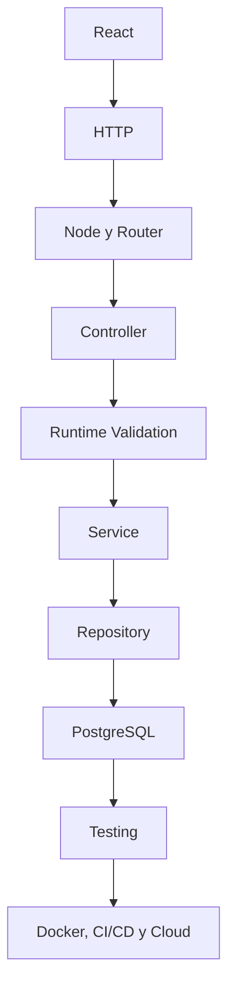

# Lección 23 — Funciones asíncronas, `Promise<T>`, `async`/`await` y manejo tipado de errores

> **Proyecto transversal de portafolio — SiteOps Tracker:** aplicación ficticia para auditar infraestructura TI en distintas sedes, registrar activos, hallazgos, estados, responsables, acciones correctivas e historial. Arquitectura Full Stack objetivo: React + TypeScript, Node.js/Express + TypeScript, PostgreSQL, Testing y Docker. Todos los nombres, datos y escenarios son ficticios.


**Ruta:** Full Stack Developer con TypeScript  
**Etapa actual:** TypeScript profundo  
**Duración estimada:** 15–20 minutos de estudio guiado  
**Práctica adicional sugerida:** 25–35 minutos  

---

## Introducción

Una aplicación Full Stack pasa gran parte de su tiempo esperando:

- una respuesta HTTP;
- una consulta a PostgreSQL;
- la lectura de un archivo;
- la verificación de un token;
- una operación de almacenamiento;
- una API externa;
- un temporizador o un mensaje de una cola.

JavaScript permite iniciar esas operaciones sin detener todo el proceso mientras espera. TypeScript agrega contratos estáticos para describir qué valor estará disponible cuando la operación termine.

La pieza central es `Promise<T>`:

```ts
Promise<Audit>
```

Este tipo significa:

> “La operación puede completar en el futuro y, si se cumple correctamente, producirá un `Audit`.”

Pero hay dos límites importantes:

1. `Promise<Audit>` no demuestra que una respuesta HTTP realmente tenga forma de `Audit`.
2. El parámetro `T` describe el valor exitoso, pero no tipa automáticamente todos los errores que podrían rechazarse.

Por eso esta lección combina `Promise<T>`, `async`/`await`, errores profesionales, validación runtime con Zod y las capas de una aplicación real.

---

## Objetivo

Al terminar esta lección podrás:

1. explicar qué problema resuelve la programación asíncrona;
2. tipar funciones que retornan `Promise<T>`;
3. comprender qué hace `async` y qué obtiene `await`;
4. distinguir ejecución secuencial de concurrencia con `Promise.all`;
5. manejar errores capturados como `unknown`;
6. diferenciar errores técnicos de resultados esperados del dominio;
7. consumir HTTP sin confiar ciegamente en `response.json()`;
8. validar datos externos con Zod;
9. aplicar asincronía en React, Node.js, Services, Repositories y PostgreSQL;
10. probar código asíncrono con Vitest y Testing Library;
11. reconocer errores frecuentes como Promises flotantes y `await` olvidados.

---

## 1. Qué problema resuelve la asincronía

Una función síncrona termina su trabajo antes de devolver el control:

```ts
function formatHostname(hostname: string): string {
  return hostname.trim().toUpperCase();
}

const result = formatHostname(" router-core-01 ");
console.log(result);
```

No hay que esperar una red, un disco o una base de datos. El resultado está disponible inmediatamente.

Una operación de entrada/salida no puede producir su resultado de inmediato:

```ts
const response = fetch("/api/audits");
```

`fetch` no devuelve directamente los datos. Devuelve una Promise que representa un resultado futuro.

```ts
const responsePromise: Promise<Response> = fetch("/api/audits");
```

Mientras la operación externa está pendiente, el runtime puede continuar atendiendo otros eventos. Cuando la operación termina, la continuación correspondiente vuelve a ejecutarse.

Esto es crucial para un backend Node.js: una consulta lenta no debería impedir que el proceso atienda todas las demás solicitudes.

> `await` pausa la continuación de la función asíncrona actual; no bloquea por sí mismo todo el event loop.

---

## 2. Qué es una Promise

Una Promise puede encontrarse conceptualmente en uno de estos estados:

```text
pending   → operación todavía pendiente
fulfilled → terminó correctamente con un valor
rejected  → terminó con un error o una razón de rechazo
```

Ejemplo explícito:

```ts
const auditIdPromise: Promise<string> = Promise.resolve(
  "audit-123",
);
```

El generic `string` describe el valor de cumplimiento:

```ts
Promise<string>
```

Otros ejemplos:

```ts
Promise<number>
Promise<Audit>
Promise<Audit[]>
Promise<Audit | null>
Promise<void>
```

Lee cada tipo de derecha a izquierda:

- `Promise<Audit[]>`: producirá una lista de auditorías;
- `Promise<Audit | null>`: producirá una auditoría o indicará ausencia;
- `Promise<void>`: terminará, pero no ofrece un valor útil al consumidor.

---

## 3. Funciones que retornan `Promise<T>`

Una función puede construir y devolver una Promise directamente:

```ts
function delay(milliseconds: number): Promise<void> {
  return new Promise((resolve) => {
    setTimeout(resolve, milliseconds);
  });
}
```

Uso con `.then()`:

```ts
delay(500).then(() => {
  console.log("Transcurrieron 500 ms");
});
```

También podemos describir una operación de dominio:

```ts
type Audit = {
  id: string;
  siteId: string;
  status: "draft" | "in_progress" | "completed";
};

function findAuditById(id: string): Promise<Audit | null> {
  // Simulación temporal de un Repository.
  return Promise.resolve(
    id === "audit-123"
      ? {
          id,
          siteId: "site-cdmx-01",
          status: "in_progress",
        }
      : null,
  );
}
```

El contrato comunica que:

- la operación no es inmediata;
- el resultado exitoso puede ser `Audit`;
- la ausencia esperada se representa con `null`;
- quien llama debe esperar y manejar ambos casos.

---

## 4. Qué hace `async`

Al declarar una función con `async`, JavaScript garantiza que retornará una Promise.

```ts
async function getProjectName(): Promise<string> {
  return "SiteOps Tracker";
}
```

Aunque el código retorna un string:

```ts
return "SiteOps Tracker";
```

el consumidor recibe:

```ts
Promise<string>
```

Esto es equivalente conceptualmente a:

```ts
function getProjectName(): Promise<string> {
  return Promise.resolve("SiteOps Tracker");
}
```

También puede inferirse el retorno:

```ts
async function getAuditCount() {
  return 42;
}

// Retorno inferido: Promise<number>
```

En funciones públicas de Services, Repositories y SDKs suele ser útil escribir explícitamente el retorno:

```ts
async function getAuditCount(): Promise<number> {
  return 42;
}
```

Esto documenta la frontera y permite detectar cambios accidentales.

---

## 5. Qué hace `await`

`await` espera el cumplimiento de una Promise y obtiene su valor exitoso:

```ts
async function printAudit(id: string): Promise<void> {
  const audit = await findAuditById(id);

  if (audit === null) {
    console.log("Auditoría no encontrada");
    return;
  }

  console.log(audit.siteId);
}
```

Antes de `await`:

```ts
const pendingAudit = findAuditById(id);
// Promise<Audit | null>
```

Después de `await`:

```ts
const audit = await findAuditById(id);
// Audit | null
```

`await` no elimina las demás posibilidades del tipo. Todavía debes manejar `null`.

Si la Promise se rechaza, `await` lanza esa razón en el flujo de la función. Puede capturarse con `try`/`catch` o propagarse al caller.

---

## 6. `Promise<void>`

Usa `Promise<void>` cuando la operación importa por su efecto y no por un valor de retorno:

```ts
async function markAuditAsReviewed(
  auditId: string,
): Promise<void> {
  await auditRepository.markAsReviewed(auditId);
}
```

Ejemplos comunes:

- actualizar un registro;
- enviar un evento;
- escribir un log;
- guardar un archivo;
- eliminar una entidad;
- ejecutar una migración.

Pero no confundas `Promise<void>` con “no puede fallar”. La Promise todavía puede rechazarse.

---

## 7. Una Promise comienza cuando inicia la operación

Las Promises no son tareas que siempre esperan a que alguien use `await`.

```ts
const auditPromise = findAuditById("audit-123");
```

La operación ya se inició al ejecutar `findAuditById`.

Después puedes esperarla:

```ts
const audit = await auditPromise;
```

Para representar una operación que todavía no debe comenzar, guarda una función:

```ts
const loadAudit = () => findAuditById("audit-123");

// Más adelante:
const audit = await loadAudit();
```

Esta diferencia importa al controlar concurrencia, reintentos y side effects.

---

## 8. Errores en funciones asíncronas

Dentro de una función `async`, lanzar un error rechaza la Promise:

```ts
async function requireAudit(id: string): Promise<Audit> {
  const audit = await findAuditById(id);

  if (audit === null) {
    throw new Error("Audit not found");
  }

  return audit;
}
```

El tipo sigue siendo:

```ts
Promise<Audit>
```

No existe un segundo generic estándar como:

```ts
// Esto no existe en Promise estándar:
Promise<Audit, AuditError>
```

`Promise<T>` describe el valor de cumplimiento. Cualquier código puede rechazar con valores diferentes, incluso con un string, aunque lanzar instancias de `Error` sea la práctica recomendada.

Por eso TypeScript no puede asumir automáticamente un tipo específico dentro de `catch`.

---

## 9. `catch` y `unknown`

Con configuración estricta, el error capturado debe tratarse como `unknown`:

```ts
async function loadAuditSafely(
  id: string,
): Promise<Audit | null> {
  try {
    return await findAuditById(id);
  } catch (error: unknown) {
    if (error instanceof Error) {
      console.error(error.message);
    } else {
      console.error("Unknown rejection", error);
    }

    return null;
  }
}
```

No hagas esto:

```ts
catch (error) {
  console.error(error.message);
}
```

Antes de leer `.message`, debes demostrar que `error` es compatible con `Error`.

Tampoco conviertas todos los errores en `null`. Eso puede borrar información crítica. La estrategia correcta depende de la capa:

- un Repository suele propagar fallos técnicos;
- un Service decide cuáles resultados de negocio son esperados;
- un Controller traduce errores conocidos a HTTP;
- un middleware central registra fallos inesperados y responde de forma segura.

---

## 10. Errores personalizados

Un error personalizado puede transportar metadatos técnicos o de aplicación:

```ts
class HttpError extends Error {
  readonly name = "HttpError";

  constructor(
    message: string,
    readonly status: number,
    readonly code: string,
  ) {
    super(message);
  }
}
```

Uso:

```ts
async function fetchJson(url: string): Promise<unknown> {
  const response = await fetch(url);

  if (!response.ok) {
    throw new HttpError(
      `Request failed with ${response.status}`,
      response.status,
      "EXTERNAL_REQUEST_FAILED",
    );
  }

  return response.json();
}
```

Narrowing:

```ts
try {
  await fetchJson("https://example.com/audits");
} catch (error: unknown) {
  if (error instanceof HttpError) {
    console.error(error.status, error.code);
  } else if (error instanceof Error) {
    console.error(error.message);
  } else {
    console.error("Unknown rejection", error);
  }
}
```

Un error personalizado no debe exponer secretos, consultas SQL completas o detalles internos al cliente.

---

## 11. Errores técnicos vs resultados esperados del dominio

No todo resultado negativo necesita una excepción.

Completar una auditoría puede producir resultados previstos:

```ts
type CompleteAuditResult =
  | {
      kind: "completed";
      audit: Audit;
    }
  | {
      kind: "not_found";
    }
  | {
      kind: "already_completed";
    };
```

El Service puede devolver una Promise del resultado:

```ts
async function completeAudit(
  auditId: string,
): Promise<CompleteAuditResult> {
  const audit = await auditRepository.findById(auditId);

  if (audit === null) {
    return { kind: "not_found" };
  }

  if (audit.status === "completed") {
    return { kind: "already_completed" };
  }

  const completedAudit = await auditRepository.complete(auditId);

  return {
    kind: "completed",
    audit: completedAudit,
  };
}
```

Una conexión perdida a PostgreSQL, en cambio, es un fallo técnico inesperado. Normalmente se propaga para que una capa central:

- lo registre;
- genere observabilidad;
- responda `500` sin filtrar detalles;
- aplique retry solamente cuando sea seguro;
- permita que la operación falle claramente.

Regla útil:

> Modela como datos los resultados de negocio esperados; usa errores para fallos técnicos o excepcionales.

---

## 12. Patrón `Result<T, E>`

Cuando necesitas que los callers manejen errores esperados explícitamente, puedes usar una discriminated union:

```ts
type Result<T, E> =
  | {
      ok: true;
      data: T;
    }
  | {
      ok: false;
      error: E;
    };
```

Ejemplo:

```ts
type CreateAuditError =
  | "SITE_NOT_FOUND"
  | "ACTIVE_AUDIT_ALREADY_EXISTS";

async function createAudit(
  siteId: string,
): Promise<Result<Audit, CreateAuditError>> {
  const siteExists = await siteRepository.exists(siteId);

  if (!siteExists) {
    return {
      ok: false,
      error: "SITE_NOT_FOUND",
    };
  }

  const hasActiveAudit =
    await auditRepository.hasActiveAudit(siteId);

  if (hasActiveAudit) {
    return {
      ok: false,
      error: "ACTIVE_AUDIT_ALREADY_EXISTS",
    };
  }

  const audit = await auditRepository.create(siteId);

  return {
    ok: true,
    data: audit,
  };
}
```

No conviertas cada fallo técnico en un `Result` gigantesco. El patrón es más útil para resultados conocidos que el caller debe manejar.

---

## 13. Consumir HTTP correctamente

Este código parece tipado, pero no valida nada:

```ts
async function getAudit(id: string): Promise<Audit> {
  const response = await fetch(`/api/audits/${id}`);
  return response.json();
}
```

Problemas:

1. `fetch` no rechaza automáticamente por respuestas `404` o `500`;
2. el body puede tener cualquier estructura;
3. una fecha JSON llega como string, no como `Date`;
4. el servidor puede cambiar o estar comprometido;
5. `Promise<Audit>` es solo una promesa estática escrita por el programador.

Una versión segura usa validación runtime:

```ts
import { z } from "zod";

const AuditSchema = z.object({
  id: z.string().uuid(),
  siteId: z.string().min(1),
  status: z.enum([
    "draft",
    "in_progress",
    "completed",
  ]),
  createdAt: z.string().datetime().transform((value) => new Date(value)),
});

type Audit = z.infer<typeof AuditSchema>;

async function getAudit(id: string): Promise<Audit> {
  const response = await fetch(`/api/audits/${id}`);

  if (!response.ok) {
    throw new HttpError(
      `Could not load audit ${id}`,
      response.status,
      "AUDIT_REQUEST_FAILED",
    );
  }

  const body: unknown = await response.json();
  return AuditSchema.parse(body);
}
```

Flujo correcto:

```text
HTTP response
     ↓
unknown
     ↓
Zod runtime validation + transformation
     ↓
Audit confiable dentro de la aplicación
```

Los tipos TypeScript desaparecen al generar JavaScript. El schema Zod sí ejecuta comprobaciones en producción.

---

## 14. TypeScript type checking vs runtime validation

| Situación | Type checking | Validación runtime |
| --- | --- | --- |
| Retorno declarado `Promise<Audit>` | Comprueba tu código | No comprueba el servidor |
| `await` sobre `Promise<Audit>` | Obtiene `Audit` estático | No inspecciona el valor real |
| JSON de `fetch` | No es confiable por sí solo | Zod puede validarlo |
| Formulario React | Tipar el estado ayuda | Los valores del usuario deben validarse |
| `process.env.PORT` | Sigue siendo `string \| undefined` | Debe validarse y convertirse |
| Archivo de configuración | El parser interno puede estar tipado | El contenido del archivo debe validarse |
| Filas de PostgreSQL | El driver puede usar generics | Los datos reales y migraciones requieren garantías |
| API externa | Un SDK puede exponer tipos | La respuesta real necesita comprobación |

TypeScript reduce errores del código que escribes. No controla sistemas externos.

---

## 15. Repository asíncrono con PostgreSQL

Una interfaz de Repository expresa operaciones futuras:

```ts
interface AuditRepository {
  findById(id: string): Promise<Audit | null>;
  listFindings(auditId: string): Promise<Finding[]>;
  complete(id: string): Promise<Audit>;
}
```

Una implementación con PostgreSQL puede verse así:

```ts
type AuditRow = {
  id: string;
  site_id: string;
  status: string;
  created_at: Date;
};

async function findAuditById(
  id: string,
): Promise<Audit | null> {
  const result = await pool.query<AuditRow>(
    `
      SELECT id, site_id, status, created_at
      FROM audits
      WHERE id = $1
    `,
    [id],
  );

  const row = result.rows[0];

  if (row === undefined) {
    return null;
  }

  return mapAuditRow(row);
}
```

Puntos importantes:

- el placeholder `$1` evita concatenar entrada no confiable en SQL;
- `Promise<Audit | null>` representa la espera y la ausencia;
- el generic del driver ayuda al type checking, pero no valida mágicamente la base;
- `mapAuditRow` separa nombres SQL de nombres del dominio;
- migrations y constraints deben mantener la estructura real compatible;
- un error de conexión se propaga como fallo técnico.

---

## 16. Ejecución secuencial

Dos operaciones son secuenciales cuando la segunda depende de la primera:

```ts
async function completeAuditAndLog(
  auditId: string,
): Promise<Audit> {
  const audit = await auditRepository.complete(auditId);

  await auditLogRepository.create({
    auditId: audit.id,
    action: "completed",
  });

  return audit;
}
```

Aquí el log necesita el resultado de `complete`.

También deben respetar secuencia las operaciones de una transacción:

```text
BEGIN
  ↓
UPDATE audit
  ↓
INSERT audit_log
  ↓
COMMIT
```

No uses `Promise.all` para ejecutar desordenadamente pasos que dependen entre sí o deben compartir una transacción.

---

## 17. Concurrencia con `Promise.all`

Si dos operaciones son independientes, pueden iniciarse juntas:

```ts
async function getAuditPageData(
  auditId: string,
): Promise<{
  audit: Audit | null;
  findings: Finding[];
}> {
  const [audit, findings] = await Promise.all([
    auditRepository.findById(auditId),
    findingRepository.listByAuditId(auditId),
  ]);

  return {
    audit,
    findings,
  };
}
```

TypeScript conserva la relación posicional:

```ts
audit;
// Audit | null

findings;
// Finding[]
```

`Promise.all`:

- inicia el grupo de operaciones sin esperarlas una por una;
- cumple cuando todas cumplen;
- rechaza si alguna rechaza;
- no deshace automáticamente side effects ya realizados;
- no convierte varias operaciones de base de datos en una transacción.

Usa concurrencia solamente cuando las operaciones sean independientes y el sistema externo pueda soportarla.

---

## 18. Secuencial accidental

Este código espera la primera operación antes de iniciar la segunda:

```ts
const audit = await auditRepository.findById(auditId);
const findings = await findingRepository.listByAuditId(auditId);
```

Si son independientes, el tiempo total se aproxima a:

```text
tiempo de audit + tiempo de findings
```

Con `Promise.all`, se aproxima más al tiempo de la operación más lenta:

```text
max(tiempo de audit, tiempo de findings)
```

Pero la optimización solo es correcta si no existe dependencia ni requisito transaccional.

---

## 19. `Promise.allSettled`

Cuando quieres conocer el resultado de todas las operaciones aunque algunas fallen:

```ts
const results = await Promise.allSettled([
  notifyByEmail(auditId),
  publishAuditEvent(auditId),
  updateSearchIndex(auditId),
]);

for (const result of results) {
  if (result.status === "fulfilled") {
    console.log("Operation completed", result.value);
  } else {
    console.error("Operation failed", result.reason);
  }
}
```

Úsalo para operaciones independientes de tipo best effort cuando necesitas observar cada resultado.

No lo uses para ocultar fallos críticos. Si publicar un evento es obligatorio para preservar consistencia, quizá necesites una transacción, un outbox pattern o una cola durable en una etapa posterior.

---

## 20. Promises flotantes

Una Promise flotante se inicia sin esperarse ni manejar su rechazo:

```ts
saveAudit(audit);
```

Problemas posibles:

- el caller continúa antes de que termine el guardado;
- un rechazo queda sin manejar;
- una prueba finaliza prematuramente;
- el proceso responde HTTP antes de completar el trabajo requerido;
- es difícil rastrear errores.

Solución normal:

```ts
await saveAudit(audit);
```

Si el comportamiento fire-and-forget es intencional, decláralo y maneja el error dentro de la operación:

```ts
void publishMetrics(audit).catch((error: unknown) => {
  logger.error({ error }, "Could not publish audit metrics");
});
```

Reglas de `typescript-eslint` útiles:

```text
@typescript-eslint/no-floating-promises
@typescript-eslint/no-misused-promises
```

Estas reglas ayudan a detectar operaciones asíncronas olvidadas.

---

## 21. `map` con funciones asíncronas

Este código no produce `Audit[]`:

```ts
const audits = auditIds.map(async (id) => {
  return auditRepository.findById(id);
});
```

Produce:

```ts
Promise<(Audit | null)>[]
```

Para esperar todos los resultados:

```ts
const audits = await Promise.all(
  auditIds.map((id) => auditRepository.findById(id)),
);
```

Resultado:

```ts
(Audit | null)[]
```

Si la lista puede contener miles de elementos, no lances miles de consultas simultáneas sin límite. En código profesional se controla la concurrencia, se pagina o se diseña una consulta SQL que recupere los datos en conjunto.

---

## 22. React: no hagas `async` directamente el callback de `useEffect`

El callback de `useEffect` debe devolver `void` o una función de limpieza, no una Promise.

Evita:

```tsx
useEffect(async () => {
  const audit = await getAudit(auditId);
  setAudit(audit);
}, [auditId]);
```

Una estructura correcta define la función dentro del effect:

```tsx
useEffect(() => {
  const controller = new AbortController();

  async function loadAudit(): Promise<void> {
    try {
      setState({ status: "loading" });

      const audit = await getAudit(
        auditId,
        controller.signal,
      );

      setState({
        status: "success",
        audit,
      });
    } catch (error: unknown) {
      if (
        error instanceof DOMException &&
        error.name === "AbortError"
      ) {
        return;
      }

      setState({
        status: "error",
        message: getErrorMessage(error),
      });
    }
  }

  void loadAudit();

  return () => {
    controller.abort();
  };
}, [auditId]);
```

Aquí `void loadAudit()` es intencional porque la función maneja internamente sus errores. La limpieza cancela la solicitud cuando cambia `auditId` o se desmonta el componente.

En aplicaciones reales, una librería de server state como TanStack Query puede resolver caching, deduplicación, reintentos y estados; aun así, debes entender `Promise<T>` y validación runtime.

---

## 23. Cancelación con `AbortSignal`

Podemos diseñar el SDK para aceptar una señal:

```ts
async function getAudit(
  id: string,
  signal?: AbortSignal,
): Promise<Audit> {
  const response = await fetch(`/api/audits/${id}`, {
    signal,
  });

  if (!response.ok) {
    throw new HttpError(
      `Could not load audit ${id}`,
      response.status,
      "AUDIT_REQUEST_FAILED",
    );
  }

  const body: unknown = await response.json();
  return AuditSchema.parse(body);
}
```

La cancelación:

- evita actualizar una UI con una respuesta obsoleta;
- libera trabajo que ya no es necesario cuando la plataforma lo soporta;
- debe distinguirse de un fallo real;
- no garantiza revertir un side effect que el servidor ya completó.

---

## 24. Node.js: Controller asíncrono

El Controller coordina transporte y dominio:

```ts
async function getAuditController(
  req: Request,
  res: Response,
  next: NextFunction,
): Promise<void> {
  try {
    const params = AuditParamsSchema.parse(req.params);
    const result = await getAuditService(params.auditId);

    if (result.kind === "not_found") {
      res.status(404).json({
        code: "AUDIT_NOT_FOUND",
      });
      return;
    }

    res.status(200).json({
      data: result.audit,
    });
  } catch (error: unknown) {
    next(error);
  }
}
```

Responsabilidades:

- el Router elige este Controller;
- Zod valida parámetros externos;
- el Controller espera al Service;
- el Service expresa resultados de dominio;
- el Controller traduce el resultado a HTTP;
- el middleware central procesa errores inesperados.

No respondas y después sigas ejecutando lógica por accidente. Usa `return` tras una respuesta terminal cuando sea necesario para clarificar el flujo.

---

## 25. Testing asíncrono con Vitest

Una prueba asíncrona debe retornar o esperar la Promise:

```ts
import { describe, expect, it, vi } from "vitest";

describe("getAuditService", () => {
  it("returns not_found when the audit does not exist", async () => {
    const repository = {
      findById: vi.fn().mockResolvedValue(null),
    };

    const result = await getAuditService(
      "missing-id",
      repository,
    );

    expect(result).toEqual({
      kind: "not_found",
    });
  });
});
```

Para rechazos:

```ts
it("propagates repository failures", async () => {
  const repository = {
    findById: vi.fn().mockRejectedValue(
      new Error("Database unavailable"),
    ),
  };

  await expect(
    getAuditService("audit-123", repository),
  ).rejects.toThrow("Database unavailable");
});
```

Error común:

```ts
expect(
  getAuditService("audit-123", repository),
).rejects.toThrow();
```

Si olvidas `await` o `return`, la prueba puede terminar antes de verificar el rechazo.

---

## 26. Testing Library y UI asíncrona

Testing Library ofrece queries asíncronas:

```tsx
render(<AuditDetails auditId="audit-123" />);

expect(
  await screen.findByText("site-cdmx-01"),
).toBeInTheDocument();
```

`findBy...` espera a que aparezca el elemento. Para una condición más específica:

```tsx
await waitFor(() => {
  expect(api.getAudit).toHaveBeenCalledWith(
    "audit-123",
    expect.any(AbortSignal),
  );
});
```

Buenas pruebas comprueban lo observable para el usuario:

- estado de carga;
- datos renderizados;
- mensaje de error;
- reintento;
- ausencia de actualizaciones obsoletas cuando aplica.

No uses esperas arbitrarias con `setTimeout` si puedes esperar una condición real.

---

## 27. Asincronía no acelera trabajo intensivo de CPU

`async`/`await` es ideal para esperar I/O. No vuelve paralela una operación intensiva de CPU:

```ts
async function parseHugeConfiguration(
  raw: string,
): Promise<ParsedConfig> {
  return parseSynchronously(raw);
}
```

Aunque la función diga `async`, `parseSynchronously` continúa ocupando el hilo mientras trabaja.

Para tareas pesadas puede ser necesario:

- optimizar el algoritmo;
- procesar por streaming;
- usar Worker Threads;
- delegar el trabajo a una cola;
- moverlo a otro servicio.

En el analizador de configuraciones de red, distinguir I/O de CPU será importante cuando los archivos crezcan.

---

## 28. Timeouts y reintentos

Una operación externa puede no responder a tiempo. Una aplicación profesional necesita límites.

Conceptualmente:

```ts
async function fetchWithTimeout(
  url: string,
  timeoutMs: number,
): Promise<Response> {
  const controller = new AbortController();
  const timeoutId = setTimeout(
    () => controller.abort(),
    timeoutMs,
  );

  try {
    return await fetch(url, {
      signal: controller.signal,
    });
  } finally {
    clearTimeout(timeoutId);
  }
}
```

Los reintentos no siempre son seguros:

- un `GET` idempotente suele ser mejor candidato;
- un `POST` podría duplicar un side effect;
- PostgreSQL puede haber confirmado antes de perderse la conexión;
- se necesitan límites, backoff, observabilidad e idempotency keys cuando corresponda.

No agregues retries indiscriminados para ocultar fallos.

---

## 29. Logging profesional

Evita logs sin contexto:

```ts
console.log(error);
```

Un logger estructurado puede registrar:

```ts
logger.error(
  {
    error,
    auditId,
    operation: "complete_audit",
  },
  "Could not complete audit",
);
```

No registres:

- contraseñas;
- tokens JWT completos;
- secretos;
- datos personales innecesarios;
- bodies completos sin revisar;
- cadenas de conexión.

El manejo de errores asíncronos debe conservar contexto suficiente para depurar sin comprometer seguridad.

---

## 30. Arquitectura Full Stack: asincronía en cada capa



### React

Inicia solicitudes, representa `loading/success/error`, cancela trabajo obsoleto y evita Promises flotantes. Los formularios requieren validación runtime.

### HTTP

Es una frontera asíncrona y no confiable. Los tipos TypeScript no viajan por la red.

### Node.js

Ejecuta JavaScript y coordina I/O. `async` no evita que código síncrono pesado bloquee el event loop.

### Router

Relaciona método y ruta con el Controller. No debe resolver lógica de negocio ni ocultar rechazos.

### Controller

Espera el Service, traduce resultados a HTTP y delega fallos técnicos a un manejador central.

### Runtime Validation

Zod valida parámetros, query, body, headers, variables de entorno, archivos y respuestas externas antes de que el dominio confíe en ellos.

### Service

Orquesta reglas de negocio, decide secuencia o concurrencia y devuelve resultados esperados del dominio.

### Repository

Encapsula consultas asíncronas, mapea filas y deja los detalles del driver fuera del Service.

### PostgreSQL

Ejecuta I/O real y protege integridad con constraints y transacciones. Una Promise no reemplaza atomicidad.

### Testing

Vitest espera Promises y prueba éxitos, rechazos y resultados. Testing Library verifica estados visibles asíncronos.

### Docker

Reproduce el runtime, pero dependencias como PostgreSQL pueden tardar en estar listas. Health checks y manejo de conexión importan.

### CI/CD

Ejecuta typecheck, reglas como `no-floating-promises`, pruebas unitarias e integración antes de desplegar.

### Cloud

Introduce latencia, timeouts, fallos parciales y reintentos. Logging, métricas y trazas permiten observar operaciones reales.

---

## 31. Relación explícita con tus proyectos

### SiteOps Tracker

Las cargas de auditorías, hallazgos y sitios retornarán Promises. Services y Repositories deben distinguir ausencia, conflicto y fallo técnico.

### API REST Node.js + TypeScript + PostgreSQL

Controllers esperan Services; Services esperan Repositories; Repositories esperan PostgreSQL. Cada capa mantiene su contrato sin mezclar HTTP, negocio y SQL.

### Dashboard React de auditorías

La interfaz representa estados asíncronos, cancela solicitudes obsoletas y valida respuestas antes de renderizarlas.

### Repositorio de algoritmos en TypeScript

La mayoría de algoritmos se analizan de forma síncrona. No uses `async` para aparentar rendimiento: la complejidad temporal y espacial no cambia.

### Analizador de configuraciones de red

Leer archivos es I/O asíncrono; parsear grandes configuraciones puede ser trabajo de CPU. Debes medir y tratar cada categoría correctamente.

### SDK tipado para una API

Cada método devuelve `Promise<T>`, comprueba `response.ok`, acepta `AbortSignal` cuando conviene y valida runtime antes de devolver tipos confiables.

### Aplicación Full Stack completa

La asincronía atraviesa todo el sistema, pero no elimina las fronteras arquitectónicas. Cada capa espera a la siguiente sin apropiarse de sus responsabilidades.

---

## 32. Cuándo usar funciones asíncronas

Úsalas para:

- HTTP y APIs externas;
- consultas a PostgreSQL;
- lectura y escritura de archivos;
- SDKs;
- colas y eventos;
- operaciones de almacenamiento;
- autenticación que consulta servicios o bases de datos;
- tareas con timers;
- flujos que dependen de resultados futuros.

Escribe el contrato más informativo posible:

```ts
Promise<Audit | null>
```

es más útil que:

```ts
Promise<any>
```

---

## 33. Cuándo no usar `async`

No lo uses sin necesidad en:

- transformaciones puras e inmediatas;
- validaciones síncronas;
- formatters;
- funciones matemáticas;
- algoritmos que no esperan I/O;
- wrappers que solo complican el tipo.

Evita:

```ts
async function formatStatus(status: string): Promise<string> {
  return status.toUpperCase();
}
```

Prefiere:

```ts
function formatStatus(status: string): string {
  return status.toUpperCase();
}
```

Agregar `async` cambia el contrato y obliga al caller a manejar una Promise sin obtener beneficio.

---

## 34. Errores comunes

### Error 1 — Olvidar `await`

```ts
const audit = getAudit("audit-123");
console.log(audit.status);
```

`audit` es una Promise, no un `Audit`.

### Error 2 — Confiar en el retorno declarado

```ts
const body = (await response.json()) as Audit;
```

La assertion no valida JSON.

### Error 3 — No comprobar `response.ok`

`fetch` puede cumplir con una respuesta `404` o `500`.

### Error 4 — Tratar `catch` como `any`

Narrowing primero; no todo rechazo garantiza `.message`.

### Error 5 — Ocultar todos los fallos con `null`

La ausencia esperada y la base de datos caída no son lo mismo.

### Error 6 — Usar `Promise.all` con dependencias

No ejecutes en paralelo pasos transaccionales o dependientes.

### Error 7 — Crear concurrencia ilimitada

Miles de Promises simultáneas pueden saturar conexiones, memoria o APIs.

### Error 8 — `async` dentro de `forEach`

```ts
auditIds.forEach(async (id) => {
  await processAudit(id);
});
```

`forEach` no espera esos callbacks. Usa `for...of` para secuencia o `Promise.all` con límites para concurrencia.

### Error 9 — Promises flotantes

Espera, retorna o maneja explícitamente cada Promise.

### Error 10 — Prueba sin `await`

Una assertion sobre `.rejects` también debe esperarse.

### Error 11 — Confundir asincronía con paralelismo de CPU

`async` no convierte automáticamente el parser en trabajo paralelo.

### Error 12 — Reintentar operaciones no idempotentes

Puedes duplicar side effects o registros.

### Error 13 — Exponer el error interno al cliente

No retornes stack traces, SQL ni secretos en una respuesta HTTP.

### Error 14 — Mezclar códigos HTTP en el Repository

El Repository conoce persistencia; el Controller conoce HTTP.

---

## 35. Ejemplo integrado: React → API → Service → Repository

### Contrato de dominio

```ts
type AuditDetails = {
  audit: Audit;
  findings: Finding[];
};
```

### Repository

```ts
interface AuditRepository {
  findById(id: string): Promise<Audit | null>;
}

interface FindingRepository {
  listByAuditId(auditId: string): Promise<Finding[]>;
}
```

### Service

```ts
type GetAuditDetailsResult =
  | {
      kind: "found";
      details: AuditDetails;
    }
  | {
      kind: "not_found";
    };

async function getAuditDetails(
  auditId: string,
): Promise<GetAuditDetailsResult> {
  const [audit, findings] = await Promise.all([
    auditRepository.findById(auditId),
    findingRepository.listByAuditId(auditId),
  ]);

  if (audit === null) {
    return { kind: "not_found" };
  }

  return {
    kind: "found",
    details: {
      audit,
      findings,
    },
  };
}
```

### Controller

```ts
async function getAuditDetailsController(
  req: Request,
  res: Response,
  next: NextFunction,
): Promise<void> {
  try {
    const params = AuditParamsSchema.parse(req.params);
    const result = await getAuditDetails(params.auditId);

    if (result.kind === "not_found") {
      res.status(404).json({
        code: "AUDIT_NOT_FOUND",
      });
      return;
    }

    res.status(200).json({
      data: result.details,
    });
  } catch (error: unknown) {
    next(error);
  }
}
```

### Cliente/SDK

```ts
const AuditDetailsSchema = z.object({
  audit: AuditSchema,
  findings: z.array(FindingSchema),
});

async function fetchAuditDetails(
  auditId: string,
  signal?: AbortSignal,
): Promise<AuditDetails> {
  const response = await fetch(
    `/api/audits/${auditId}/details`,
    { signal },
  );

  if (!response.ok) {
    throw new HttpError(
      "Could not load audit details",
      response.status,
      "AUDIT_DETAILS_REQUEST_FAILED",
    );
  }

  const body: unknown = await response.json();
  return AuditDetailsSchema.parse(body);
}
```

Este flujo mantiene separadas las responsabilidades y valida la frontera HTTP antes de que React confíe en el resultado.

---

# PRÁCTICAS

## Práctica 1 — Tipos antes y después de `await`

Dado:

```ts
declare function countAudits(): Promise<number>;
```

Dentro de una función `async` crea:

```ts
const pending = countAudits();
const resolved = await countAudits();
```

Responde:

1. ¿Qué tipo tiene `pending`?
2. ¿Qué tipo tiene `resolved`?
3. ¿Por qué no puedes sumar `pending + 1`?

---

## Práctica 2 — Retornos de funciones `async`

Predice el tipo de retorno de cada función:

```ts
async function a() {
  return "ok";
}

async function b() {
  return null;
}

async function c(): Promise<void> {
  console.log("done");
}
```

Después confirma las respuestas con el editor.

---

## Práctica 3 — Narrowing de errores

Completa el `catch` sin usar `any` ni assertion:

```ts
try {
  await synchronizeAudit("audit-123");
} catch (error: unknown) {
  // Si es Error, registra message.
  // En caso contrario, registra "Unknown rejection".
}
```

### Pista

Usa:

```ts
error instanceof Error
```

---

## Práctica 4 — Encuentra la Promise flotante

```ts
async function controller(): Promise<void> {
  auditService.complete("audit-123");
  console.log("Completed");
}
```

Explica:

1. qué ocurre;
2. cuál línea es engañosa;
3. cómo lo corregirías;
4. qué regla de lint podría detectarlo.

---

## Práctica 5 — Secuencia o concurrencia

Clasifica cada caso:

1. cargar una auditoría y sus métricas independientes;
2. insertar una auditoría y luego insertar un log que necesita su ID;
3. ejecutar `BEGIN`, dos escrituras y `COMMIT`;
4. cargar preferencias y permisos independientes;
5. validar que un sitio exista y luego crear una auditoría para ese sitio.

Indica dónde usarías `Promise.all` y dónde conservarías `await` secuenciales.

---

## Práctica 6 — Validación runtime

Corrige conceptualmente este SDK:

```ts
async function listSites(): Promise<Site[]> {
  const response = await fetch("/api/sites");
  return response.json();
}
```

Tu versión debe:

- comprobar `response.ok`;
- tratar el body como `unknown`;
- validar con `z.array(SiteSchema)`;
- retornar `Promise<Site[]>` solamente después de validar.

---

# EJERCICIO PRINCIPAL — SiteOps Tracker

Implementa un caso de uso que obtenga la vista completa de una auditoría.

## Tipos disponibles

```ts
type Audit = {
  id: string;
  siteId: string;
  status: "draft" | "in_progress" | "completed";
};

type Finding = {
  id: string;
  auditId: string;
  description: string;
  severity: "low" | "medium" | "high";
};

interface AuditRepository {
  findById(id: string): Promise<Audit | null>;
}

interface FindingRepository {
  listByAuditId(auditId: string): Promise<Finding[]>;
}
```

## Resultado requerido

```ts
type GetAuditViewResult =
  | {
      kind: "found";
      audit: Audit;
      findings: Finding[];
      highSeverityCount: number;
    }
  | {
      kind: "not_found";
    };
```

## Función por completar

```ts
async function getAuditView(
  auditId: string,
  auditRepository: AuditRepository,
  findingRepository: FindingRepository,
): Promise<GetAuditViewResult> {
  // Tu solución
}
```

## Requisitos

1. Obtén auditoría y hallazgos de forma asíncrona.
2. Decide justificadamente si las consultas pueden ser concurrentes.
3. Si no existe la auditoría, retorna `{ kind: "not_found" }`.
4. Cuenta hallazgos con severidad `high`.
5. No uses `any`.
6. No captures un error técnico para convertirlo en `not_found`.
7. No uses assertions para forzar tipos.
8. Escribe al menos dos pruebas con Vitest.

## Pistas

- Ambas operaciones reciben `auditId` y no necesitan el resultado de la otra para iniciar.
- `Promise.all` conserva el orden de los resultados.
- Después de `await`, `audit` continúa siendo `Audit | null`.
- `filter` puede contar hallazgos de alta severidad.
- Un rechazo del Repository debe propagarse salvo que exista una política explícita.

## Pruebas mínimas sugeridas

1. auditoría encontrada con dos hallazgos `high`;
2. auditoría inexistente;
3. opcional: Repository rechazado con error técnico.

> No se incluye la solución completa. Implementa primero tu versión y compártela para recibir análisis, aciertos, errores y pistas.

---

# RETO — API REST + PostgreSQL + validación + testing

Crea el flujo para iniciar una auditoría:

```text
POST /audits/:auditId/start
```

El Service puede producir:

```ts
type StartAuditResult =
  | {
      kind: "started";
      audit: Audit;
    }
  | {
      kind: "not_found";
    }
  | {
      kind: "invalid_status";
      currentStatus: Audit["status"];
    };
```

## Debes diseñar

1. un schema Zod para `auditId`;
2. un Controller asíncrono;
3. un Service con `Promise<StartAuditResult>`;
4. un Repository con una actualización parametrizada;
5. traducción de resultados a `200`, `404` y `409`;
6. propagación de fallos técnicos;
7. pruebas unitarias del Service;
8. una prueba de integración del endpoint.

## Restricciones

- El Service no conoce `Request`, `Response` ni códigos HTTP.
- El Repository no devuelve respuestas HTTP.
- No uses `as Audit` para una fila externa.
- No conviertas una caída de PostgreSQL en `not_found`.
- Espera cada Promise necesaria.
- Si actualizas estado y escribes historial, explica cómo usarías una transacción.

## Pistas

- El Controller valida y traduce.
- El Service decide si la transición de estado es válida.
- El Repository persiste.
- PostgreSQL protege invariantes y atomicidad.
- Vitest comprueba comportamiento; TypeScript comprueba contratos.

---

## Preguntas de comprensión

1. ¿Qué representa `T` en `Promise<T>`?
2. ¿Qué retorna realmente una función declarada con `async`?
3. ¿Qué tipo obtiene `await` desde `Promise<Audit | null>`?
4. ¿`Promise<Audit>` valida una respuesta HTTP?
5. ¿Por qué un error capturado debe tratarse como `unknown`?
6. ¿Por qué `Promise<T>` no tipa todos los posibles rechazos?
7. ¿Cuándo conviene retornar una discriminated union en lugar de lanzar?
8. ¿Cuál es la diferencia entre ejecución secuencial y `Promise.all`?
9. ¿Qué ocurre si una Promise de `Promise.all` rechaza?
10. ¿Por qué `Promise.all` no crea una transacción PostgreSQL?
11. ¿Qué es una Promise flotante?
12. ¿Por qué `map(async ...)` produce un array de Promises?
13. ¿Por qué el callback de `useEffect` no debe ser `async`?
14. ¿`async` acelera una tarea intensiva de CPU?
15. ¿Qué deben comprobar Vitest y Testing Library que el tipo no puede probar?

---

## Relevancia para entrevistas técnicas

### Pregunta: What does an async function return in TypeScript?

Respuesta sugerida:

> An async function always returns a Promise. If I return a value of type `T`, the caller receives `Promise<T>`. If the function throws, the Promise rejects.

### Pregunta: Does `Promise<User>` guarantee that an HTTP response is a valid user?

> No. `Promise<User>` is a compile-time contract for the fulfilled value. HTTP data exists at runtime, so I treat the parsed body as unknown and validate it with a runtime schema before returning a trusted `User`.

### Pregunta: When would you use `Promise.all`?

> I use `Promise.all` for independent asynchronous operations that can run concurrently. I avoid it when one operation depends on another, when ordering matters, or when the operations must be part of a database transaction.

### Pregunta: How do you handle errors in an async TypeScript function?

> I treat caught values as unknown and narrow them before reading properties. I model expected business outcomes as typed results or discriminated unions, while unexpected technical failures are propagated to a centralized error handler with structured logging.

### Pregunta: What is a floating Promise?

> A floating Promise is created without being awaited, returned, or explicitly handled. It can lead to unhandled rejections and incorrect execution order. I use `await`, return the Promise, or intentionally handle it, and I enable `no-floating-promises` in ESLint.

### Cómo explicarlo con tu portafolio

> In SiteOps Tracker, my fictional infrastructure-audit portfolio application, Controllers await Services, Services coordinate domain rules, and Repositories perform asynchronous PostgreSQL operations. Expected outcomes such as not found or invalid status are modeled as discriminated unions. Unexpected database failures propagate to centralized error handling. On the React side, the SDK validates HTTP responses at runtime before components use the data.

Una respuesta sólida debe mencionar:

- `Promise<T>`;
- `async` y `await`;
- `unknown` en `catch`;
- errores esperados frente a fallos técnicos;
- validación runtime;
- secuencia frente a concurrencia;
- separación de capas;
- testing asíncrono.

---

## Checklist de revisión

Antes de aprobar código asíncrono, comprueba:

- [ ] ¿El retorno declara un `Promise<T>` informativo?
- [ ] ¿Todas las Promises se esperan, retornan o manejan explícitamente?
- [ ] ¿Las operaciones concurrentes son realmente independientes?
- [ ] ¿Las transacciones PostgreSQL conservan orden y atomicidad?
- [ ] ¿Se comprueba `response.ok`?
- [ ] ¿Los datos HTTP, formularios, APIs, archivos y env se validan en runtime?
- [ ] ¿Los errores capturados se tratan como `unknown`?
- [ ] ¿Se distinguen resultados del dominio y fallos técnicos?
- [ ] ¿Los logs incluyen contexto sin exponer secretos?
- [ ] ¿Existe cancelación o timeout cuando aplica?
- [ ] ¿Los reintentos son limitados e idempotentes?
- [ ] ¿Vitest espera correctamente resoluciones y rechazos?
- [ ] ¿Testing Library verifica estados visibles?
- [ ] ¿ESLint detecta Promises flotantes?
- [ ] ¿CI ejecuta typecheck, lint y tests?

---

## Resumen

En esta lección aprendiste que:

- `Promise<T>` representa un valor futuro de tipo `T` cuando la operación cumple;
- una función `async` siempre retorna una Promise;
- `await` obtiene el valor de cumplimiento y pausa la continuación de la función actual;
- `Promise<void>` puede fallar aunque no produzca un valor útil;
- `Promise<T>` no describe todos los posibles rechazos;
- los errores capturados deben tratarse como `unknown` y reducirse con guards;
- resultados esperados pueden modelarse con discriminated unions o `Result<T, E>`;
- fallos técnicos deben conservarse, registrarse y manejarse en la capa adecuada;
- `fetch` requiere comprobar `response.ok` y validar el body real;
- los tipos TypeScript desaparecen en runtime;
- HTTP, formularios, APIs externas, archivos, variables de entorno y PostgreSQL requieren garantías reales;
- Zod valida y transforma datos externos;
- `Promise.all` sirve para operaciones independientes, no para pasos dependientes o transacciones;
- las Promises flotantes producen orden incorrecto y rechazos sin manejar;
- React debe representar estados asíncronos y limpiar trabajo obsoleto;
- Vitest y Testing Library deben esperar el comportamiento real;
- `async` ayuda con I/O, pero no vuelve paralelo el trabajo intensivo de CPU;
- cada capa conserva una responsabilidad clara desde React hasta Cloud.

El objetivo profesional no es agregar `await` hasta que desaparezcan los errores del editor. Es diseñar flujos asíncronos cuyo orden, errores, datos y límites sean explícitos.

---

# Próxima lección

**Lección 24 — Módulos ES, `import`/`export` y organización del código por responsabilidades.**
