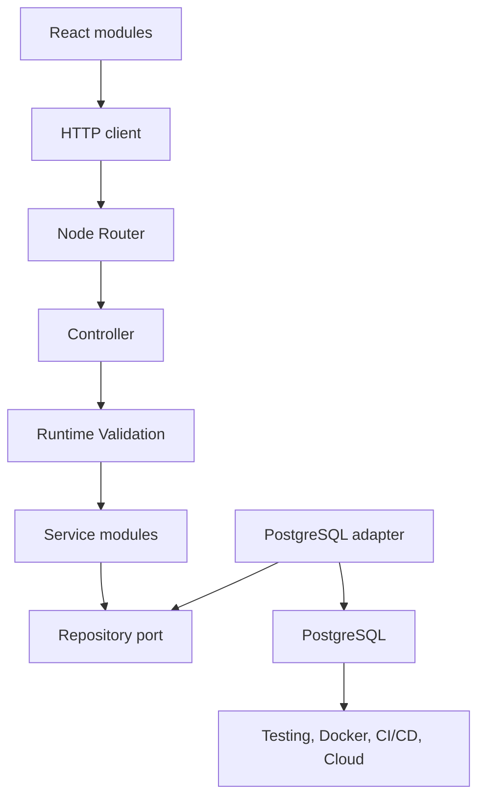

# Lección 24 — Módulos ES, `import`/`export` y organización del código por responsabilidades

> **Proyecto transversal de portafolio — SiteOps Tracker:** aplicación ficticia para auditar infraestructura TI en distintas sedes, registrar activos, hallazgos, estados, responsables, acciones correctivas e historial. Arquitectura Full Stack objetivo: React + TypeScript, Node.js/Express + TypeScript, PostgreSQL, Testing y Docker. Todos los nombres, datos y escenarios son ficticios.


**Ruta:** Full Stack Developer con TypeScript  
**Etapa actual:** TypeScript profundo  
**Duración estimada:** 15–20 minutos de estudio guiado  
**Práctica adicional sugerida:** 25–35 minutos  

---

## Introducción

Hasta ahora hemos escrito tipos, funciones, schemas, Services y Repositories en ejemplos relativamente pequeños. Una aplicación Full Stack real pronto contiene cientos de archivos.

El problema deja de ser únicamente “¿cómo funciona esta función?” y se convierte también en:

- ¿dónde debe vivir esta función?;
- ¿qué parte del sistema puede importarla?;
- ¿qué detalles deben permanecer privados?;
- ¿cómo evitamos dependencias circulares?;
- ¿cómo separamos React, HTTP, negocio y PostgreSQL?;
- ¿qué imports existen solo para TypeScript y cuáles existen en runtime?;
- ¿por qué un import funciona en el editor, pero falla dentro de Docker?;

Los **módulos ES** permiten dividir el programa en archivos con dependencias explícitas. En TypeScript utilizamos principalmente `export` e `import` para crear esas fronteras.

Pero separar código en archivos no garantiza una buena arquitectura. También necesitamos establecer una dirección de dependencias y organizar cada módulo por responsabilidad.

> Un módulo profesional no es solo un archivo: es una frontera que decide qué ofrece públicamente y qué conserva como detalle interno.

---

## Objetivo

Al terminar esta lección podrás:

1. explicar qué problema resuelven los módulos;
2. usar exports e imports nombrados;
3. distinguir un import de valor de un `import type`;
4. comprender cuándo un import existe en runtime;
5. usar re-exports y archivos `index.ts` sin ocultar dependencias importantes;
6. reconocer diferencias conceptuales entre ESM y CommonJS;
7. evitar ciclos, side effects inesperados y alias incompletos;
8. organizar SiteOps Tracker por responsabilidades;
9. mantener la dirección React → HTTP → Node → Router → Controller → Validation → Service → Repository → PostgreSQL;
10. diseñar módulos fáciles de probar con Vitest;
11. explicar por qué Zod es un valor runtime y no solo un tipo.

---

## 1. El problema del espacio global

Imagina dos archivos sin módulos:

```ts
// audit.ts
const status = "in_progress";
```

```ts
// device.ts
const status = "online";
```

En un modelo basado en scripts globales, ambos nombres pueden chocar porque comparten el mismo espacio global.

Además, no queda claro:

- de dónde proviene una función;
- qué archivo depende de cuál;
- qué API es pública;
- qué código puede cambiarse sin afectar consumidores;
- en qué orden deben cargarse los scripts.

Los módulos resuelven esto dando a cada archivo su propio scope y haciendo explícitas las dependencias.

---

## 2. Qué convierte un archivo en módulo

En TypeScript, un archivo que contiene un `import` o `export` de nivel superior se trata como módulo:

```ts
export const applicationName = "SiteOps Tracker";
```

Sus declaraciones no se agregan automáticamente al scope global.

Otro archivo debe importarlas:

```ts
import { applicationName } from "./application-name.js";

console.log(applicationName);
```

Si un archivo no necesita exportar nada, pero quieres marcarlo explícitamente como módulo, puedes escribir:

```ts
export {};
```

En proyectos modernos, la mayoría de los archivos de aplicación deben ser módulos.

---

## 3. Export nombrado

Un export nombrado conserva el nombre de la declaración:

```ts
// audit-status.ts
export type AuditStatus =
  | "draft"
  | "in_progress"
  | "completed";

export function isCompleted(
  status: AuditStatus,
): boolean {
  return status === "completed";
}
```

Importación:

```ts
import {
  isCompleted,
  type AuditStatus,
} from "./audit-status.js";
```

Ventajas frecuentes:

- el nombre es consistente entre módulos;
- el editor puede autocompletarlo;
- los refactors son claros;
- un archivo puede ofrecer varias declaraciones;
- resulta evidente qué miembros se consumen.

---

## 4. Exportar después de declarar

También puedes declarar primero y exportar después:

```ts
type AuditStatus =
  | "draft"
  | "in_progress"
  | "completed";

function isCompleted(
  status: AuditStatus,
): boolean {
  return status === "completed";
}

export {
  isCompleted,
  type AuditStatus,
};
```

Ambas formas son válidas. Elige una convención consistente para el proyecto.

---

## 5. Export default

Un módulo puede tener un único export default:

```ts
// format-audit-status.ts
export default function formatAuditStatus(
  status: string,
): string {
  return status.replaceAll("_", " ");
}
```

El consumidor elige el nombre local:

```ts
import formatStatus from "./format-audit-status.js";
```

También podría elegir otro nombre:

```ts
import formatter from "./format-audit-status.js";
```

Los default exports no son incorrectos, pero los exports nombrados suelen facilitar:

- búsquedas;
- refactors;
- consistencia de nombres;
- autocompletado;
- re-exports explícitos.

En esta ruta usaremos principalmente exports nombrados. En React es común encontrar ambas convenciones.

---

## 6. Renombrar un import

Cuando dos módulos exportan el mismo nombre, puedes crear un alias local:

```ts
import {
  parse as parseAudit,
} from "./audit-parser.js";

import {
  parse as parseDevice,
} from "./device-parser.js";
```

El alias solo cambia el nombre dentro del archivo consumidor. No modifica el export original.

Evita alias innecesarios que dificulten rastrear el símbolo. Úsalos cuando resuelvan una ambigüedad real.

---

## 7. Importar todo como namespace de módulo

Puedes importar todos los exports bajo un objeto de módulo:

```ts
import * as auditParser from "./audit-parser.js";

const result = auditParser.parse(rawConfig);
```

Esto puede ser útil cuando:

- el módulo expone operaciones relacionadas;
- quieres hacer explícito el origen en cada uso;
- integras una biblioteca diseñada para ese estilo.

No debe confundirse con los `namespace` de TypeScript. Aquí estamos usando sintaxis estándar de módulos ES.

---

## 8. Imports de valor vs imports de tipo

Esta distinción es esencial en TypeScript.

### Import de valor

```ts
import { AuditSchema } from "./audit.schema.js";
```

`AuditSchema` existe en runtime porque Zod necesita ejecutarlo.

### Import de tipo

```ts
import type { Audit } from "./audit.schema.js";
```

`Audit` solo existe durante el type checking. TypeScript elimina ese import del JavaScript generado cuando se utiliza exclusivamente como tipo.

También puedes combinar ambos:

```ts
import {
  AuditSchema,
  type Audit,
} from "./audit.schema.js";
```

Esto comunica con claridad cuáles dependencias existen en runtime.

---

## 9. Los tipos desaparecen; los valores permanecen

Archivo TypeScript:

```ts
import {
  AuditSchema,
  type Audit,
} from "./audit.schema.js";

export function parseAudit(
  input: unknown,
): Audit {
  return AuditSchema.parse(input);
}
```

Conceptualmente, el JavaScript conserva lo necesario en runtime:

```js
import { AuditSchema } from "./audit.schema.js";

export function parseAudit(input) {
  return AuditSchema.parse(input);
}
```

Desaparecen:

- `type Audit`;
- la anotación `input: unknown`;
- el retorno `: Audit`.

Permanece `AuditSchema` porque es un objeto real que ejecuta validación.

Error grave:

```ts
import type { AuditSchema } from "./audit.schema.js";

AuditSchema.parse(input);
```

No puedes usar como valor algo importado únicamente como tipo.

---

## 10. Schema runtime y tipo derivado

Un módulo puede ofrecer ambos contratos:

```ts
// audit.schema.ts
import { z } from "zod";

export const AuditStatusSchema = z.enum([
  "draft",
  "in_progress",
  "completed",
]);

export const AuditSchema = z.object({
  id: z.string().uuid(),
  siteId: z.string().min(1),
  status: AuditStatusSchema,
  createdAt: z.string().datetime(),
});

export type Audit = z.infer<typeof AuditSchema>;
```

En un Controller:

```ts
import { AuditSchema } from "./audit.schema.js";

const audit = AuditSchema.parse(req.body);
```

En una función interna que solo necesita el tipo:

```ts
import type { Audit } from "./audit.schema.js";

export function formatAudit(
  audit: Audit,
): string {
  return `${audit.siteId}: ${audit.status}`;
}
```

Esto conecta type checking con runtime validation sin confundirlos.

---

## 11. Re-exportar símbolos

Un módulo puede publicar símbolos procedentes de otro:

```ts
// audits/index.ts
export { AuditSchema } from "./audit.schema.js";
export type { Audit } from "./audit.schema.js";
export { createGetAudit } from "./get-audit.service.js";
```

El consumidor importa desde la API pública de la feature:

```ts
import {
  AuditSchema,
  createGetAudit,
  type Audit,
} from "./audits/index.js";
```

El archivo `index.ts` suele llamarse **barrel file**.

Puede ser útil para definir una superficie pública estable. Pero no debe exportar automáticamente cada archivo interno.

---

## 12. Riesgos de los barrel files

Este patrón parece cómodo:

```ts
export * from "./audit.schema.js";
export * from "./audit.repository.js";
export * from "./audit.service.js";
export * from "./audit.controller.js";
export * from "./audit.routes.js";
```

Puede causar:

- API pública demasiado grande;
- dependencias circulares difíciles de detectar;
- imports que atraviesan capas accidentalmente;
- carga de módulos con side effects;
- nombres duplicados;
- dificultad para conocer el origen real de un símbolo;
- impacto no deseado en bundling o tree shaking según la herramienta.

Regla práctica:

> Usa barrels pequeños en fronteras públicas claras; evita un `index.ts` global que re-exporte toda la aplicación.

Prefiere re-exports explícitos:

```ts
export { createGetAudit } from "./get-audit.service.js";
export type { GetAuditResult } from "./get-audit.service.js";
```

---

## 13. API pública y detalles internos

Supón esta feature:

```text
audits/
├── audit.schema.ts
├── audit.repository.port.ts
├── get-audit.service.ts
├── audit.errors.ts
├── internal/
│   └── normalize-audit.ts
└── index.ts
```

`index.ts` puede publicar solamente:

```ts
export { AuditSchema } from "./audit.schema.js";
export type { Audit } from "./audit.schema.js";
export { createGetAudit } from "./get-audit.service.js";
export type {
  AuditRepository,
} from "./audit.repository.port.js";
```

`normalize-audit.ts` permanece como detalle interno. El resto de la aplicación no debería depender de él.

Una API pública pequeña permite cambiar la implementación sin romper consumidores.

---

## 14. Separar por responsabilidades

Una primera organización de SiteOps Tracker podría ser:

```text
src/
├── domain/
│   └── audits/
│       ├── audit.schema.ts
│       └── audit.rules.ts
├── application/
│   └── audits/
│       ├── audit.repository.port.ts
│       └── get-audit.service.ts
├── infrastructure/
│   └── postgres/
│       └── postgres-audit.repository.ts
├── presentation/
│   └── http/
│       └── audits/
│           ├── audit.controller.ts
│           └── audit.routes.ts
├── shared/
│   ├── errors/
│   └── logging/
├── app.ts
└── server.ts
```

Responsabilidades:

- `domain`: conceptos y reglas centrales;
- `application`: casos de uso y puertos que necesitan;
- `infrastructure`: PostgreSQL, archivos, APIs externas;
- `presentation`: HTTP, Controllers y Routes;
- `shared`: utilidades realmente transversales;
- `app.ts`: construcción de la aplicación;
- `server.ts`: inicio del proceso.

No existe una única estructura universal. Lo importante es que los nombres y dependencias expresen una arquitectura comprensible.

---

## 15. Dirección de dependencias

Las capas externas pueden depender de contratos internos. El dominio no debe depender de Express o PostgreSQL.

```text
Router
  ↓
Controller
  ↓
Service / caso de uso
  ↓
Repository port
  ↑
PostgreSQL adapter implementa el port
```

Ejemplo de port:

```ts
// application/audits/audit.repository.port.ts
import type { Audit } from "../../domain/audits/audit.schema.js";

export interface AuditRepository {
  findById(id: string): Promise<Audit | null>;
}
```

El Service depende de la interfaz:

```ts
// application/audits/get-audit.service.ts
import type { Audit } from "../../domain/audits/audit.schema.js";
import type {
  AuditRepository,
} from "./audit.repository.port.js";

export type GetAuditResult =
  | {
      kind: "found";
      audit: Audit;
    }
  | {
      kind: "not_found";
    };

export function createGetAudit(
  repository: AuditRepository,
) {
  return async function getAudit(
    id: string,
  ): Promise<GetAuditResult> {
    const audit = await repository.findById(id);

    return audit === null
      ? { kind: "not_found" }
      : { kind: "found", audit };
  };
}
```

El Service no importa:

- Express;
- `pg`;
- el Router;
- el Controller;
- variables de entorno;
- códigos HTTP.

Esto hace que la regla sea portátil y fácil de probar.

---

## 16. Adapter de PostgreSQL

La infraestructura implementa el port:

```ts
// infrastructure/postgres/postgres-audit.repository.ts
import type { Pool } from "pg";
import type { Audit } from "../../domain/audits/audit.schema.js";
import type {
  AuditRepository,
} from "../../application/audits/audit.repository.port.js";

type AuditRow = {
  id: string;
  site_id: string;
  status: string;
  created_at: Date;
};

export class PostgresAuditRepository
  implements AuditRepository
{
  constructor(private readonly pool: Pool) {}

  async findById(id: string): Promise<Audit | null> {
    const result = await this.pool.query<AuditRow>(
      `
        SELECT id, site_id, status, created_at
        FROM audits
        WHERE id = $1
      `,
      [id],
    );

    const row = result.rows[0];

    if (row === undefined) {
      return null;
    }

    return mapAuditRow(row);
  }
}
```

El adapter conoce PostgreSQL y el contrato del Repository. El Service conoce solo el contrato.

El generic `AuditRow` ayuda al compilador, pero no valida por sí mismo la estructura real de PostgreSQL. Migraciones, constraints, integración y mapeo continúan siendo necesarios.

---

## 17. Composition root

En algún lugar deben conectarse las implementaciones reales:

```ts
// app.ts
import express from "express";
import { pool } from "./infrastructure/postgres/pool.js";
import {
  PostgresAuditRepository,
} from "./infrastructure/postgres/postgres-audit.repository.js";
import {
  createGetAudit,
} from "./application/audits/get-audit.service.js";
import {
  createAuditController,
} from "./presentation/http/audits/audit.controller.js";
import {
  createAuditRouter,
} from "./presentation/http/audits/audit.routes.js";

export function createApp() {
  const auditRepository =
    new PostgresAuditRepository(pool);

  const getAudit = createGetAudit(auditRepository);
  const auditController =
    createAuditController({ getAudit });
  const auditRouter =
    createAuditRouter(auditController);

  const app = express();
  app.use(express.json());
  app.use("/audits", auditRouter);

  return app;
}
```

`app.ts` funciona como **composition root**: conoce implementaciones y las conecta.

El archivo que inicia el proceso puede mantenerse separado:

```ts
// server.ts
import { createApp } from "./app.js";
import { env } from "./config/env.js";

const app = createApp();

app.listen(env.PORT, () => {
  console.log(`Server listening on ${env.PORT}`);
});
```

Separar `createApp()` de `listen()` permite probar la aplicación sin abrir un puerto real en cada test.

---

## 18. Side effects al importar

Un módulo puede ejecutar código en cuanto se importa:

```ts
// bad-server.ts
import express from "express";

const app = express();

app.listen(3000);
```

Solo importar ese archivo abre un puerto. Esto es un side effect de inicialización.

Otros side effects problemáticos:

- conectarse a PostgreSQL durante cualquier import;
- leer variables de entorno antes de preparar el test;
- iniciar cron jobs;
- registrar listeners globales;
- escribir archivos;
- ejecutar migraciones;
- enviar eventos.

Prefiere exportar funciones de construcción y ejecutar efectos desde entry points claros.

```ts
export function startServer(): void {
  const app = createApp();
  app.listen(env.PORT);
}
```

Los side effects no siempre son evitables, pero deben ser intencionales, visibles y controlados.

---

## 19. Dependencias circulares

Existe un ciclo cuando los módulos dependen entre sí:

```text
audit.service.ts
      ↓
audit.controller.ts
      ↓
audit.service.ts
```

Ejemplo conceptual incorrecto:

```ts
// audit.service.ts
import {
  toHttpStatus,
} from "./audit.controller.js";
```

```ts
// audit.controller.ts
import {
  createGetAudit,
} from "./audit.service.js";
```

Problemas posibles:

- valores `undefined` durante inicialización;
- orden de ejecución difícil de predecir;
- pruebas frágiles;
- bundling inesperado;
- arquitectura invertida.

Solución: mueve la regla al módulo propietario correcto.

- El Service devuelve un resultado de dominio.
- El Controller transforma ese resultado a HTTP.
- El Service nunca importa al Controller.

Una dirección de dependencias consistente evita muchos ciclos.

---

## 20. Ciclos de tipos y `import type`

`import type` puede evitar que una dependencia exclusivamente estática produzca un import runtime. Eso reduce algunos ciclos de ejecución:

```ts
import type { Audit } from "./audit.types.js";
```

Pero no debe utilizarse para esconder un diseño confuso. Si dos módulos necesitan conocer demasiados detalles mutuos, revisa sus responsabilidades.

`import type` aclara la naturaleza de la dependencia; no sustituye una buena arquitectura.

---

## 21. ESM y CommonJS

En el ecosistema Node.js existen dos sistemas que encontrarás con frecuencia.

### ECMAScript Modules — ESM

```ts
import { createApp } from "./app.js";
export { createApp };
```

### CommonJS — CJS

```js
const { createApp } = require("./app");
module.exports = { createApp };
```

TypeScript puede compilar para distintos sistemas, pero mezclar configuraciones sin comprender el runtime causa errores como:

```text
Cannot use import statement outside a module
```

```text
require is not defined in ES module scope
```

```text
ERR_MODULE_NOT_FOUND
```

En un proyecto ESM de Node, suelen coordinarse:

- `package.json` con `"type": "module"`;
- opciones compatibles de `module` y `moduleResolution`;
- extensiones correctas en imports relativos;
- herramientas de tests y build configuradas para el mismo modelo.

No copies una sola opción aislada sin revisar el toolchain completo.

---

## 22. Por qué un archivo `.ts` puede importar `.js`

En un proyecto Node ESM configurado con resolución `NodeNext`, puedes escribir:

```ts
import { createApp } from "./app.js";
```

aunque el archivo fuente sea:

```text
app.ts
```

TypeScript resuelve `./app.js` contra `app.ts` durante desarrollo y mantiene el specifier para que el JavaScript generado importe el archivo real:

```text
dist/app.js
```

Esto depende de la configuración y del runtime elegido. Un proyecto controlado por un bundler puede usar otras reglas.

Regla importante:

> La sintaxis de imports debe ser compatible tanto con TypeScript como con el sistema que ejecutará o empaquetará el JavaScript.

---

## 23. Rutas relativas

Import relativo:

```ts
import type { Audit } from "../../domain/audits/audit.schema.js";
```

Ventajas:

- funciona sin aliases especiales;
- muestra la relación física;
- es explícito.

Desventajas:

- puede volverse largo;
- mover archivos requiere actualizar rutas;
- demasiados `../../..` pueden indicar una estructura incómoda.

No conviertas automáticamente toda ruta larga en alias. Primero revisa si el módulo está en la capa correcta.

---

## 24. Path aliases

TypeScript puede reconocer aliases:

```ts
import type { Audit } from "@domain/audits/audit.schema";
```

Pero configurar `paths` para el compilador no siempre modifica el specifier emitido ni enseña al runtime a resolverlo.

También deben entender el alias, según el proyecto:

- Node.js o un loader;
- el bundler;
- Vitest;
- ESLint;
- herramientas de migraciones;
- scripts de desarrollo;
- el entorno de producción.

Un import que funciona en el editor puede fallar al ejecutar JavaScript si solo TypeScript conoce el alias.

Usa aliases cuando reduzcan complejidad y configura todo el toolchain de manera coherente.

---

## 25. Mayúsculas y minúsculas

Este import puede funcionar en un sistema de archivos que no distingue mayúsculas:

```ts
import { AuditSchema } from "./Audit.Schema.js";
```

Aunque el archivo real sea:

```text
audit.schema.ts
```

Después puede fallar en Linux, Docker o CI.

Activa opciones y reglas que detecten casing inconsistente, y mantén una convención de nombres estable.

Este es un ejemplo clásico de “funciona en mi computadora” que un pipeline debe descubrir antes de producción.

---

## 26. Importar desde la capa equivocada

Esto rompe la separación:

```ts
// domain/audits/audit.rules.ts
import type { Request } from "express";
```

El dominio no necesita conocer Express.

También es incorrecto que React importe directamente un Repository de PostgreSQL:

```ts
// frontend
import {
  PostgresAuditRepository,
} from "../../backend/infrastructure/postgres/...";
```

El navegador no debe conectarse directamente a PostgreSQL. React se comunica mediante HTTP con la API.

La arquitectura protege límites técnicos y de seguridad, no solo la estética de carpetas.

---

## 27. Imports en React

Un frontend puede organizarse por feature:

```text
src/
├── features/
│   └── audits/
│       ├── api/
│       │   └── audit.api.ts
│       ├── components/
│       │   └── AuditCard.tsx
│       ├── hooks/
│       │   └── useAudit.ts
│       ├── model/
│       │   └── audit.schema.ts
│       └── index.ts
├── shared/
│   ├── http/
│   └── ui/
└── app/
```

Dirección típica:

```text
Component
   ↓
hook / query
   ↓
API client
   ↓
HTTP
```

El componente no necesita conocer `fetch` si el cliente API encapsula transporte y validación.

```ts
// audit.api.ts
import {
  AuditSchema,
  type Audit,
} from "../model/audit.schema.js";

export async function fetchAudit(
  id: string,
): Promise<Audit> {
  const response = await fetch(`/api/audits/${id}`);

  if (!response.ok) {
    throw new Error(`HTTP ${response.status}`);
  }

  const body: unknown = await response.json();
  return AuditSchema.parse(body);
}
```

El tipo describe el contrato interno. Zod valida la respuesta real.

---

## 28. Imports dinámicos

Un import dinámico retorna una Promise:

```ts
const module = await import("./audit-report.js");
const report = module.createAuditReport(audits);
```

Puede servir para:

- cargar una feature bajo demanda;
- separar bundles en frontend;
- cargar adapters opcionales;
- evitar pagar el costo inicial de módulos pesados.

En React:

```tsx
const AuditReportPage = lazy(
  () => import("./AuditReportPage.js"),
);
```

No uses imports dinámicos para esconder una mala organización. Agregan asincronía, estados de carga y posibles errores de carga que deben manejarse.

---

## 29. Tree shaking y módulos sin side effects

Los bundlers pueden eliminar exports no utilizados cuando comprenden la estructura de módulos y sus efectos.

Este módulo es fácil de analizar:

```ts
export function formatStatus(status: string): string {
  return status.toUpperCase();
}
```

Este módulo ejecuta trabajo al importarse:

```ts
connectToDatabase();

export function formatStatus(status: string): string {
  return status.toUpperCase();
}
```

Los side effects complican:

- tree shaking;
- pruebas;
- orden de inicialización;
- reutilización;
- razonamiento sobre dependencias.

Prefiere módulos que exporten capacidades y entry points que decidan cuándo ejecutarlas.

---

## 30. Testing y módulos

La inyección de dependencias reduce mocks frágiles basados en el sistema de módulos.

Service:

```ts
export function createGetAudit(
  repository: AuditRepository,
) {
  return async function getAudit(
    id: string,
  ): Promise<GetAuditResult> {
    const audit = await repository.findById(id);

    return audit === null
      ? { kind: "not_found" }
      : { kind: "found", audit };
  };
}
```

Test con fake:

```ts
import { describe, expect, it } from "vitest";
import {
  createGetAudit,
} from "./get-audit.service.js";
import type {
  AuditRepository,
} from "./audit.repository.port.js";

describe("getAudit", () => {
  it("returns not_found", async () => {
    const repository: AuditRepository = {
      findById: async () => null,
    };

    const getAudit = createGetAudit(repository);
    const result = await getAudit("missing-id");

    expect(result).toEqual({
      kind: "not_found",
    });
  });
});
```

No fue necesario importar PostgreSQL ni abrir una conexión. El módulo depende de un contrato pequeño.

Los mocks de módulos siguen siendo útiles, pero no deben compensar una arquitectura excesivamente acoplada.

---

## 31. Módulos y configuración runtime

Un módulo de configuración puede validar variables al inicio:

```ts
// config/env.ts
import { z } from "zod";

const EnvSchema = z.object({
  NODE_ENV: z.enum([
    "development",
    "test",
    "production",
  ]),
  PORT: z.coerce.number().int().min(1).max(65_535),
  DATABASE_URL: z.string().min(1),
});

export const env = EnvSchema.parse(process.env);
```

Este módulo ejecuta validación al importarse. Puede ser una decisión consciente para que el proceso falle rápido si falta configuración.

Pero considera testing:

- configura variables antes de importar el módulo;
- o exporta una función `parseEnv(input)` para pruebas puras;
- evita que muchos módulos lean `process.env` directamente;
- nunca exportes secretos hacia código del navegador.

TypeScript no valida `process.env`; Zod sí lo hace en runtime.

---

## 32. Arquitectura Full Stack y módulos



### React

Los componentes importan hooks y clientes de la feature. No importan detalles de PostgreSQL ni código exclusivo de Node.

### HTTP

El cliente encapsula `fetch`, errores de transporte y schemas de respuesta. Los tipos no viajan por la red.

### Node.js

El runtime carga módulos de valor. Imports incorrectos o ciclos pueden fallar antes de servir una solicitud.

### Router

Importa Controllers y define rutas. No importa Repositories para ejecutar negocio directamente.

### Controller

Importa schemas runtime y casos de uso. Traduce HTTP a dominio y dominio a HTTP.

### Runtime Validation

Los schemas Zod son valores exportados. Se importan como valores porque deben ejecutarse.

### Service

Importa tipos de dominio y puertos. No importa Express ni drivers SQL.

### Repository

El port define lo que necesita la aplicación. El adapter PostgreSQL importa el driver y cumple ese contrato.

### PostgreSQL

Permanece detrás de la infraestructura. Constraints y transacciones protegen datos reales.

### Testing

Vitest importa módulos públicos y sustituye puertos con fakes. Testing Library prueba módulos React desde la perspectiva del usuario.

### Docker

Ejecuta en Linux y revela problemas de casing, extensiones y resolución que podían pasar inadvertidos localmente.

### CI/CD

Ejecuta typecheck, lint, tests y build para comprobar que el grafo de módulos sea válido.

### Cloud

Ejecuta el JavaScript construido. Solo existen imports de valor; los tipos ya desaparecieron.

---

## 33. Relación explícita con tus proyectos

### SiteOps Tracker

Separa auditorías, sitios, dispositivos y hallazgos en features con APIs públicas pequeñas. Controllers no deben contener SQL y Services no deben importar Express.

### API REST Node.js + TypeScript + PostgreSQL

Usa ports para los Repositories, adapters para PostgreSQL y un composition root que conecte dependencias reales.

### Dashboard React de auditorías

Organiza por feature: componentes, hooks, cliente HTTP y schemas. React importa el SDK o cliente, no módulos internos del backend.

### Repositorio de algoritmos en TypeScript

Cada problema puede exportar su función y sus tipos desde un módulo pequeño. Los tests importan solo la API que deben comprobar.

### Analizador de configuraciones de red

Separa lectura de archivos, tokenizer, parser, reglas y generador de reportes. El parser no debe abrir archivos por sí mismo si puede recibir texto o tokens.

### SDK tipado para una API

Define una API pública estable mediante exports explícitos. Mantén internos el transporte, serializers y helpers. Publica schemas cuando el consumidor necesite validación runtime.

### Aplicación Full Stack completa

Frontend y backend pueden compartir contratos cuidadosamente seleccionados, pero no detalles incompatibles con cada runtime. El paquete compartido no debe importar `fs`, `pg`, Express ni componentes React si pretende funcionar en ambos lados.

---

## 34. Cuándo crear un módulo nuevo

Crea un módulo cuando:

- existe una responsabilidad distinguible;
- el código tiene una API reutilizable;
- quieres ocultar detalles internos;
- la dependencia merece ser explícita;
- una capa técnica debe aislarse;
- un archivo creció por mezclar conceptos;
- necesitas probar una unidad con dependencias pequeñas.

Un módulo no necesita ser enorme. También puede contener una función pura bien nombrada.

---

## 35. Cuándo no dividir más

Evita dividir cuando:

- cada archivo contiene una sola línea sin aportar una frontera;
- navegar requiere abrir demasiados archivos para entender una operación simple;
- las piezas siempre cambian juntas y no tienen responsabilidades distintas;
- creas abstracciones antes de entender el dominio;
- el nombre del módulo es genérico como `utils.ts` o `helpers.ts` y acumula funciones no relacionadas.

La meta no es maximizar el número de archivos. Es lograr cohesión alta dentro de cada módulo y acoplamiento controlado entre módulos.

---

## 36. Errores comunes

### Error 1 — Exportar todo

Una API pública enorme permite que cualquier capa dependa de detalles internos.

### Error 2 — Usar default y named import incorrectamente

```ts
export default function createApp() {}
```

No se importa con:

```ts
import { createApp } from "./app.js";
```

### Error 3 — Importar un schema con `import type`

Zod necesita el schema en runtime.

### Error 4 — Importar un tipo como valor sin necesidad

Usa `import type` para comunicar dependencias eliminables.

### Error 5 — Crear ciclos

Controller → Service es razonable; Service → Controller invierte la dirección.

### Error 6 — Ejecutar el servidor al importar `app.ts`

Separa construcción y arranque para mejorar testing.

### Error 7 — Suponer que `paths` configura el runtime

TypeScript, bundler, tests y Node deben estar alineados.

### Error 8 — Ignorar casing

Un import puede funcionar en Windows y fallar en Docker/Linux.

### Error 9 — Mezclar ESM y CommonJS sin estrategia

`import`/`export`, `require`, `package.json` y `tsconfig` deben ser compatibles.

### Error 10 — Importar infraestructura desde dominio

El dominio no debe depender de Express, `pg` o APIs cloud.

### Error 11 — Usar barrels globales

Pueden ocultar origen, generar ciclos y ampliar la API accidentalmente.

### Error 12 — Compartir código incompatible entre frontend y backend

Un módulo compartido no puede depender de APIs exclusivas de Node si se ejecutará en navegador.

### Error 13 — Confiar en tipos importados para validar HTTP

`import type { Audit }` no valida un JSON. Importa y ejecuta `AuditSchema`.

### Error 14 — Colocar todo en `utils.ts`

Agrupa por propósito, no por la vaga categoría “utilidad”.

### Error 15 — Profundidad de carpetas sin beneficio

La estructura debe facilitar comprensión, no demostrar sofisticación.

---

## 37. Ejemplo integrado: módulo de auditorías

### Dominio y validación

```ts
// domain/audits/audit.schema.ts
import { z } from "zod";

export const AuditSchema = z.object({
  id: z.string().uuid(),
  siteId: z.string().min(1),
  status: z.enum([
    "draft",
    "in_progress",
    "completed",
  ]),
});

export type Audit = z.infer<typeof AuditSchema>;
```

### Port de aplicación

```ts
// application/audits/audit.repository.port.ts
import type { Audit } from "../../domain/audits/audit.schema.js";

export interface AuditRepository {
  findById(id: string): Promise<Audit | null>;
}
```

### Caso de uso

```ts
// application/audits/get-audit.service.ts
import type { Audit } from "../../domain/audits/audit.schema.js";
import type {
  AuditRepository,
} from "./audit.repository.port.js";

export type GetAuditResult =
  | { kind: "found"; audit: Audit }
  | { kind: "not_found" };

export function createGetAudit(
  repository: AuditRepository,
) {
  return async function getAudit(
    id: string,
  ): Promise<GetAuditResult> {
    const audit = await repository.findById(id);

    if (audit === null) {
      return { kind: "not_found" };
    }

    return {
      kind: "found",
      audit,
    };
  };
}
```

### Controller

```ts
// presentation/http/audits/audit.controller.ts
import { z } from "zod";
import type {
  NextFunction,
  Request,
  Response,
} from "express";
import type {
  GetAuditResult,
} from "../../../application/audits/get-audit.service.js";

const ParamsSchema = z.object({
  auditId: z.string().uuid(),
});

type GetAudit = (
  id: string,
) => Promise<GetAuditResult>;

export function createAuditController(
  dependencies: { getAudit: GetAudit },
) {
  return async function getAuditController(
    req: Request,
    res: Response,
    next: NextFunction,
  ): Promise<void> {
    try {
      const params = ParamsSchema.parse(req.params);
      const result = await dependencies.getAudit(
        params.auditId,
      );

      if (result.kind === "not_found") {
        res.status(404).json({
          code: "AUDIT_NOT_FOUND",
        });
        return;
      }

      res.status(200).json({
        data: result.audit,
      });
    } catch (error: unknown) {
      next(error);
    }
  };
}
```

El grafo de imports cuenta una historia:

```text
Controller → caso de uso → port → tipo de dominio
                    ↑
       adapter PostgreSQL conectado en app.ts
```

Cada módulo tiene un motivo claro para cambiar.

---

# PRÁCTICAS

## Práctica 1 — Named exports

Crea:

```text
device-status.ts
```

Debe exportar:

- `DeviceStatus` como tipo;
- `isOperational` como función.

Después impórtalos desde otro archivo usando un import combinado con `type`.

### Pista

```ts
import {
  isOperational,
  type DeviceStatus,
} from "./device-status.js";
```

---

## Práctica 2 — Tipo o valor

Clasifica cada símbolo:

```ts
type Audit = { id: string };
interface Repository {}
const AuditSchema = z.object({ id: z.string() });
class HttpError extends Error {}
function parseAudit(input: unknown) {}
```

Responde:

1. ¿Cuáles pueden importarse con `import type`?
2. ¿Cuáles deben existir en runtime?
3. ¿Cuáles desaparecen del JavaScript?

---

## Práctica 3 — Detectar la dependencia incorrecta

Revisa:

```ts
// audit.service.ts
import type { Request } from "express";
import { pool } from "../postgres/pool.js";
```

Explica:

1. qué responsabilidades se mezclaron;
2. qué contratos necesita realmente el Service;
3. qué módulo debe conocer `Request`;
4. qué módulo debe conocer `pool`.

---

## Práctica 4 — Evitar side effects

Refactoriza conceptualmente:

```ts
// app.ts
const app = express();
app.listen(3000);
```

Separa:

- `createApp()`;
- `server.ts`;
- lectura validada de `PORT`.

No escribas todavía toda la aplicación; describe exports e imports necesarios.

---

## Práctica 5 — Barrel limitado

Una feature tiene:

```text
audits/
├── audit.schema.ts
├── audit.service.ts
├── normalize-audit.internal.ts
└── index.ts
```

Diseña `index.ts` para publicar schema, tipo y Service, pero no el helper interno.

Usa re-exports explícitos y `export type`.

---

## Práctica 6 — Círculo arquitectónico

Dibuja las dependencias de:

```text
route → controller → service → repository port
postgres repository → repository port
```

Después explica por qué:

```text
service → controller
```

crearía una dirección incorrecta.

---

# EJERCICIO PRINCIPAL — Reorganizar SiteOps Tracker

Actualmente tienes una feature de auditorías concentrada en un archivo conceptual:

```text
audits.ts
```

Contiene:

- tipo `Audit`;
- schema Zod de parámetros;
- consulta SQL;
- regla para encontrar auditoría;
- Controller Express;
- Router;
- arranque del servidor.

Tu tarea es proponer y escribir el esqueleto de módulos para separar esas responsabilidades.

## Archivos mínimos

```text
src/
├── domain/audits/audit.schema.ts
├── application/audits/audit.repository.port.ts
├── application/audits/get-audit.service.ts
├── infrastructure/postgres/postgres-audit.repository.ts
├── presentation/http/audits/audit.controller.ts
├── presentation/http/audits/audit.routes.ts
├── app.ts
└── server.ts
```

## Debes definir

1. qué exporta cada archivo;
2. qué importa cada archivo;
3. cuáles imports son `type`;
4. dónde vive Zod;
5. dónde vive SQL;
6. dónde se traduce `not_found` a `404`;
7. dónde se conectan las dependencias;
8. dónde se ejecuta `listen()`.

## Restricciones

- El Service no importa Express.
- El Service no importa `pg`.
- El dominio no importa Controller ni Router.
- El Repository no responde HTTP.
- `app.ts` no debe abrir un puerto.
- `server.ts` es el entry point que inicia el proceso.
- La respuesta HTTP debe validarse en el frontend antes de considerarse `Audit`.
- No crees un barrel global que exporte todo.

## Pistas

- El port pertenece a la capa de aplicación.
- El adapter PostgreSQL implementa el port.
- El composition root conoce las implementaciones concretas.
- Zod es un valor runtime.
- `Audit` derivado con `z.infer` es un tipo.
- El Controller traduce dominio ↔ HTTP.
- El Router conecta rutas ↔ Controller.

## Qué debes explicar al terminar

1. ¿Cuál es la dirección de dependencias?
2. ¿Qué módulos podrían probarse sin PostgreSQL?
3. ¿Qué imports desaparecerán del JavaScript?
4. ¿Por qué `AuditSchema` debe permanecer en runtime?
5. ¿Cómo evita la estructura un ciclo?

> No se incluye la solución completa. Primero diseña tu estructura y comparte los módulos para recibir revisión, aciertos, errores y pistas.

---

# RETO — Feature pública, adapter intercambiable y Vitest

Construye una feature `audits` con una API pública controlada.

## Requisitos

1. `AuditRepository` debe ser un port.
2. Crea un `PostgresAuditRepository` como adapter real.
3. Crea un `InMemoryAuditRepository` para tests.
4. `createGetAudit` debe aceptar el port por inyección.
5. Un `index.ts` de aplicación debe exportar únicamente el caso de uso y sus tipos públicos.
6. El helper que mapea filas SQL debe permanecer interno.
7. Escribe una prueba con Vitest sin importar `pg`.
8. Ejecuta una comprobación de ciclos con la herramienta que elijas más adelante o revisa manualmente el grafo.
9. Documenta qué cambia si Node usa ESM con `NodeNext`.

## Restricciones

- No uses `any`.
- No uses assertions para inventar entidades.
- No importes el adapter real desde el test unitario.
- No abras conexiones al importar el módulo.
- No expongas `mapAuditRow` desde el barrel público.
- Valida datos externos en la frontera adecuada.

## Pistas

- El fake puede ser un objeto que cumple `AuditRepository`.
- El composition root elige entre implementaciones.
- Usa `import type` para ports y entidades cuando solo se necesiten estáticamente.
- Un schema Zod debe importarse como valor cuando se ejecuta `.parse()`.
- Revisa casing y extensiones desde un entorno Linux/Docker.

---

## Preguntas de comprensión

1. ¿Qué convierte un archivo TypeScript en módulo?
2. ¿Qué diferencia existe entre un named export y un default export?
3. ¿Qué hace `import type`?
4. ¿Por qué `AuditSchema` no puede importarse solamente como tipo?
5. ¿Qué desaparece al compilar TypeScript?
6. ¿Qué es un barrel file?
7. ¿Por qué `export *` puede ampliar demasiado una API pública?
8. ¿Qué es una dependencia circular?
9. ¿Cómo ayuda la dirección Controller → Service → port?
10. ¿Qué es un composition root?
11. ¿Por qué conviene separar `createApp()` de `listen()`?
12. ¿Qué diferencia conceptual existe entre ESM y CommonJS?
13. ¿Por qué un proyecto Node ESM puede escribir `.js` en imports desde archivos `.ts`?
14. ¿Por qué configurar `paths` en TypeScript puede no bastar?
15. ¿Cómo puede un problema de casing aparecer solo en Docker o CI?
16. ¿Por qué un tipo compartido no valida datos HTTP?
17. ¿Cuándo utilizarías un import dinámico?
18. ¿Qué ventaja aporta probar un Service contra un port?

---

## Relevancia para entrevistas técnicas

### Pregunta: What is the difference between a type-only import and a value import?

Respuesta sugerida:

> A type-only import is used exclusively by the TypeScript type checker and is removed from the emitted JavaScript. A value import must exist at runtime, for example a function, class, constant, or Zod schema.

### Pregunta: How do ES modules help application architecture?

> ES modules make dependencies explicit and give each file its own scope. I use module boundaries to expose a small public API, hide implementation details, and enforce dependency direction between Controllers, Services, Repository ports, and infrastructure adapters.

### Pregunta: What is a circular dependency?

> A circular dependency happens when modules depend on each other directly or indirectly. It can cause initialization problems and usually indicates unclear ownership or inverted layer dependencies. I address it by moving shared contracts to the correct layer and keeping dependencies directed inward.

### Pregunta: Why separate app creation from server startup?

> Separating `createApp` from `listen` avoids opening a port as an import side effect. It makes integration testing easier because tests can instantiate the app without starting the production server.

### Pregunta: Does a TypeScript path alias automatically work at runtime?

> Not necessarily. TypeScript may resolve the alias for type checking, but the runtime, bundler, test runner, and other tools must also understand it. I configure the complete toolchain and verify the production build.

### Cómo explicarlo con tu portafolio

> In SiteOps Tracker, my fictional infrastructure-audit portfolio application, I separate domain schemas, application services, Repository ports, PostgreSQL adapters, HTTP Controllers, and Routes into explicit modules. Services depend on interfaces rather than the database driver, while the composition root connects the real implementations. This keeps business logic testable and prevents React or HTTP concerns from leaking into the domain.

Una respuesta sólida debe mencionar:

- imports y exports explícitos;
- diferencia type/value;
- tipos eliminados en runtime;
- API pública pequeña;
- dirección de dependencias;
- ports y adapters;
- composition root;
- ciclos y side effects;
- configuración coordinada del runtime.

---

## Checklist de revisión

Antes de aprobar la organización de módulos, comprueba:

- [ ] ¿Cada módulo tiene una responsabilidad clara?
- [ ] ¿Los exports públicos son intencionales?
- [ ] ¿Uso `import type` cuando la dependencia es solo estática?
- [ ] ¿Los schemas Zod se importan como valores?
- [ ] ¿El dominio permanece independiente de Express y PostgreSQL?
- [ ] ¿Los Services dependen de ports pequeños?
- [ ] ¿La infraestructura implementa esos ports?
- [ ] ¿Existe un composition root claro?
- [ ] ¿`createApp()` está separado de `listen()`?
- [ ] ¿Evité side effects inesperados al importar?
- [ ] ¿No existen ciclos entre capas?
- [ ] ¿Los barrels exponen solo la API prevista?
- [ ] ¿Las extensiones y el casing funcionan en Linux/Docker?
- [ ] ¿Aliases y resolución están configurados en todo el toolchain?
- [ ] ¿Vitest puede probar el Service sin infraestructura real?
- [ ] ¿Los datos externos continúan validándose en runtime?
- [ ] ¿CI ejecuta typecheck, lint, tests y build?

---

## Resumen

En esta lección aprendiste que:

- los módulos evitan el espacio global y hacen explícitas las dependencias;
- `export` define la API que otro módulo puede consumir;
- los named exports suelen facilitar consistencia y refactors;
- `import type` representa una dependencia exclusiva del type checker;
- tipos e interfaces desaparecen del JavaScript;
- funciones, clases, constantes y schemas Zod permanecen en runtime;
- re-exports y barrels deben usarse como fronteras públicas controladas;
- una dirección de dependencias consistente evita ciclos y mezcla de capas;
- Services pueden depender de Repository ports sin conocer PostgreSQL;
- adapters concretos se conectan en un composition root;
- separar `createApp()` de `listen()` reduce side effects y facilita testing;
- ESM y CommonJS son sistemas distintos que requieren configuración coherente;
- imports, extensiones, aliases y casing deben funcionar también en runtime, Docker y CI;
- React importa clientes HTTP y schemas compatibles con navegador, no infraestructura backend;
- un tipo importado no valida HTTP, formularios, archivos, variables de entorno ni filas de base de datos;
- Zod y PostgreSQL continúan proporcionando garantías runtime;
- una buena estructura maximiza cohesión y controla acoplamiento sin dividir por dividir.

La meta profesional no es crear más carpetas. Es diseñar fronteras en las que cada dependencia tenga una razón clara y cada cambio afecte la menor superficie posible.

---

# Próxima lección

**Lección 25 — `tsconfig.json`, modo `strict`, `module`, `moduleResolution`, `target`, `lib` y `types`.**
